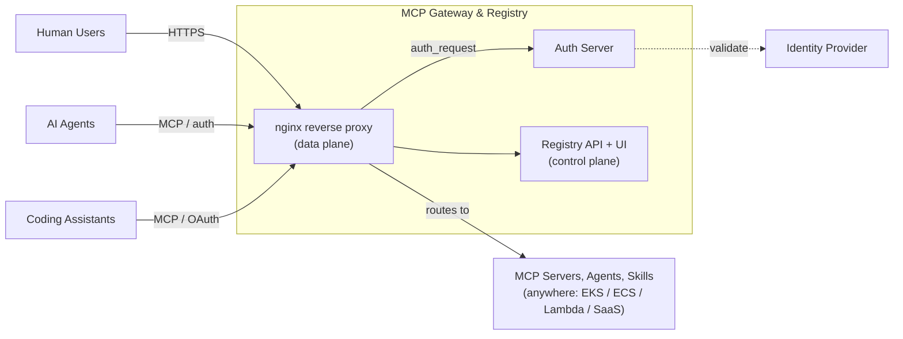

<!-- Budget: 350 lines max (CI-enforced). Feature announcements -> docs/overview/feature-release-highlights.md (top 3 mirrored here). Structure rationale -> docs/design/theory-of-the-system.md#6-how-to-change-this-system-without-breaking-its-theory -->
<div align="center">


**Unified Agent & MCP Server Registry – Gateway for AI Development Tools**

[](https://github.com/agentic-community/mcp-gateway-registry/stargazers)
[](https://github.com/agentic-community/mcp-gateway-registry/network)
[](LICENSE)
[](https://github.com/agentic-community/mcp-gateway-registry/releases)

[Get Running Now](#quick-start) | [Docs](https://agentic-community.github.io/mcp-gateway-registry/) | [Executive Brief](docs/overview/executive-brief.md) | [Slide Deck](docs/slides/mcp-gateway-registry-presentation.pdf) | [Demo Videos](docs/demo-videos.md) | [AWS Workshop](https://catalog.us-east-1.prod.workshops.aws/workshops/0c3265a6-1a4a-467b-ae56-e4d019184b0e/en-US) | [Community](#community)

</div>

---

The **MCP Gateway & Registry** is a single, governed control plane for every AI asset in your organization, from MCP servers and AI agents to skills and any custom asset your teams build. It is open source, licensed under Apache 2.0, and runs on Kubernetes (Amazon EKS), fully managed serverless (Amazon ECS), or Docker Compose (Amazon EC2).

It began as a gateway and registry for the [Model Context Protocol (MCP)](https://modelcontextprotocol.io/introduction): one secure entry point to many MCP servers, with centralized discovery and governance. As teams started registering agents, skills, and other assets alongside their servers, it grew into a general-purpose **AI asset registry** on the same gateway, access-control, and audit model it started with.

## Why we built this

Without a control plane, every team wires its own MCP servers and agents by hand: separate credentials in every dotfile, no shared inventory, no audit trail, and no way to discover or govern what exists. Agents can't find other agents; servers and agents live in separate registries that can't share policy.

This platform replaces that with **one governed entry point for every AI asset**. Register a server, agent, skill, or custom entity once; discover it by natural-language search; reach it through a single authenticated gateway that enforces access and records every call. One control plane, one access model, one audit trail, across all asset types.

```
┌─────────────────────────────────────┐     ┌──────────────────────────────────────────────────────┐
│          BEFORE: Chaos              │     │    AFTER: MCP Gateway & Registry                     │
├─────────────────────────────────────┤     ├──────────────────────────────────────────────────────┤
│                                     │     │                                                      │
│  Developer 1 ──┬──► MCP Server A    │     │  Developer 1 ──┐                  ┌─ MCP Server A    │
│                ├──► MCP Server B    │     │                │                  ├─ MCP Server B    │
│                └──► MCP Server C    │     │  Developer 2 ──┼──► MCP Gateway   │                  │
│                                     │     │                │    & Registry ───┼─ MCP Server C    │
│  Developer 2 ──┬──► MCP Server A    │ ──► │  AI Agent 1 ───┘         │        │                  │
│                ├──► MCP Server D    │     │                          │        ├─ AI Agent 1      │
│                └──► MCP Server E    │     │  AI Agent 2 ──────────────┤        ├─ AI Agent 2     │
│                                     │     │                          │        │                  │
│  AI Agent 1 ───┬──► MCP Server B    │     │  AI Agent 3 ──────────────┘        └─ AI Agent 3     │
│                ├──► MCP Server C    │     │                                                      │
│                └──► MCP Server F    │     │              Single Connection Point                 │
│                                     │     │                                                      │
│  ❌ Multiple connections per user  │     │         ✅ One gateway for all                      │
│  ❌ No centralized control         │     │         ✅ Unified server & agent access            │
│  ❌ Credential sprawl              │     │         ✅ Unified governance & audit trails        │
└─────────────────────────────────────┘     └──────────────────────────────────────────────────────┘
```

**Onboard third-party OAuth MCP servers, the enterprise way.** Because the gateway provides [per-user egress authentication](docs/design/egress-auth-design.md), you can connect OAuth-protected SaaS MCP servers such as Slack, Atlassian, and GitHub without every user setting up network access to those services or storing credentials on their laptop. Each user connects their account once; the gateway runs the OAuth (3LO) flow, vaults the per-user token in a secrets manager, and injects it on egress. That collapses onboarding to a single, auditable choke point, so a team can adopt a new SaaS MCP server across the enterprise without per-laptop plumbing or scattered long-lived tokens.

## How it works

The gateway is the **data plane** (a generic nginx reverse proxy: TLS, auth validation, routing to backends) and the registry is the **control plane** (a FastAPI service that owns the inventory, access model, and audit trail, and decides what the gateway may route to). An **auth server** integrates your identity provider (Keycloak, Entra ID, Okta, Auth0, Cognito, PingFederate) for OAuth2/OIDC, and **MongoDB / DocumentDB** stores configuration, embeddings, sessions, and audit records.



By default, the registry handles A2A discovery, authentication, and access control, and agents then communicate directly (peer-to-peer) rather than routing every call through the gateway. For the full design and its invariants, read the [Theory of the System](docs/design/theory-of-the-system.md); for layered diagrams, see [Architecture Diagrams](docs/architecture-diagrams.md).

## See it in action

Watch how MCP servers, A2A agents, and external registries work together for dynamic tool discovery:

https://github.com/user-attachments/assets/97c640db-f78b-4a6c-9662-894f975f66e2

More walkthroughs are in the [demo videos](docs/demo-videos.md).

## Start here if you are a...

| You are a... | Start here |
|---|---|
| **Developer** | Start with the [Complete Setup Guide](docs/complete-setup-guide.md); you can also try the [macOS setup skill](.claude/skills/macos-setup/SKILL.md) to get it running on your MacBook. Then connect your AI coding assistant with the [AI Coding Assistant Integration guide](docs/ai-coding-assistants-setup.md). For programmatic access, see the [OpenAPI spec](api/openapi.json) plus a Python registration client ([`registry_client.py`](api/registry_client.py)) and CLI ([`registry_management.py`](api/registry_management.py)). |
| **Platform / security / ops team** | See the deployment guides for [Amazon EKS (Helm)](charts/README.md), [Amazon ECS (Terraform)](terraform/aws-ecs/README.md), and [Docker Compose](docs/installation.md); the [authentication guide](docs/auth.md); the [configuration reference](docs/configuration.md); and [access control & scopes](docs/scopes.md). |
| **Decision-maker evaluating adoption** | Read the [Executive Brief](docs/overview/executive-brief.md), watch the [demo videos](docs/demo-videos.md), and try the [AWS Workshop](https://catalog.us-east-1.prod.workshops.aws/workshops/0c3265a6-1a4a-467b-ae56-e4d019184b0e/en-US). |

## Quick Start

The fastest path is the pre-built Docker images. Clone, set a few secrets, and run:

```bash
git clone https://github.com/agentic-community/mcp-gateway-registry.git
cd mcp-gateway-registry
cp .env.example .env

# Edit .env and set the required secrets (e.g. KEYCLOAK_ADMIN_PASSWORD, SECRET_KEY).
# See docs/configuration.md for the full list.
nano .env

# Deploy with pre-built images (pulled from Amazon ECR Public by default)
./build_and_run.sh --prebuilt

# Open the Registry UI (served by nginx on port 80)
open http://localhost        # macOS  (Linux: xdg-open http://localhost)
```

The [Complete Installation Guide](docs/installation.md) has the full walkthrough for **Amazon EC2** (prerequisites, MongoDB and Keycloak initialization, first user and service account, registering a server, and testing the gateway).

**Deploying somewhere else?**

- **Amazon ECS**: see the [Terraform stack README](terraform/aws-ecs/README.md), or better, use the [Terraform setup skill](.claude/skills/terraform-setup/SKILL.md) to have your AI coding assistant run the deployment for you.
- **Amazon EKS**: see the [Helm charts](charts/README.md).
- **Just want to try it on macOS?**: use the [macOS setup skill](.claude/skills/macos-setup/SKILL.md) to get it running on your MacBook end to end.

## What's in the box

The registry holds four built-in asset types plus admin-defined custom ones, all on one control plane:

- **MCP servers**: register, discover, and govern access to MCP servers behind a single authenticated gateway.
- **Agents (A2A)**: register agents and let them discover each other by capability; by default agent-to-agent traffic runs peer-to-peer.
- **Skills**: register, version, and discover reusable `SKILL.md` skills, with security scanning at registration.
- **Custom entities**: admins define their own schema-driven entity types (n8n workflows, policies, prompt templates, model cards, and more); see [Custom Entity Types](docs/custom-entities.md).

Across all of them you get semantic + lexical search, UI, REST, and MCP-native interfaces, and uniform governance. Key features worth calling out:

- **Single authenticated gateway**: one entry point; OAuth against your existing IdP (Keycloak, Entra ID, Okta, Auth0, Cognito, PingFederate) with fine-grained [scopes](docs/scopes.md).
- **Dynamic tool discovery**: agents and coding assistants find tools at runtime by natural-language [semantic search](docs/dynamic-tool-discovery.md), not hard-coded config.
- **[Virtual MCP servers](docs/design/virtual-mcp-server.md)**: aggregate tools from many backends behind one endpoint, with per-tool access control.
- **[Per-user egress auth (3LO / OBO / PAT)](docs/design/egress-auth-design.md)**: the gateway brokers third-party SaaS credentials so tokens never live on a user's laptop.
- **Security scanning + [fail-closed admission gate](docs/registration-webhooks.md)**: every registered server, agent, and skill is scanned; unsafe items are held for review.
- **[External-registry federation](docs/federation.md)**: pull in Anthropic's MCP Registry, AWS Agent Registry, and peer registries for one unified surface.
- **[Audit logging](docs/audit-logging.md)**: a full, attributable audit trail of access and admin events, with credential masking, for compliance and incident review.
- **Observability**: [OpenTelemetry metrics](docs/OBSERVABILITY.md) and health monitoring built in.

## What's New

<!-- Exactly the 5 most-recent highlights. Older entries live in docs/overview/feature-release-highlights.md; the release-notes skill rotates this list. Do not grow it. -->

- **Application-Level Rate Limiting** - Identity/group/target-aware request limits enforced at the auth-server `/validate` hop, complementary to the coarse per-IP nginx edge limiting. Cap a caller (user or agent, by group membership) and/or a target (MCP server / A2A agent), each per time window, with config-time lockout-safeguard floors and a fail-open availability guardrail. Off by default; limit definitions are managed at runtime via the admin API / CLI / UI. [Rate Limiting Design](docs/design/rate-limiting.md).
- **A2A Reverse-Proxy Mode** - Opt in to route agent-to-agent traffic through the gateway the same way MCP servers are proxied: each enabled agent gets authenticated `/agent/{path}` routes, its real backend stays private (`proxy_pass_url`), discovery advertises the gateway URL, and every call is gated per-agent with `invoke_agent`. [A2A Guide](docs/a2a.md#reverse-proxy-mode-routing-a2a-traffic-through-the-gateway) · [Design](docs/design/a2a-protocol-integration.md#reverse-proxy-mode-proxying-a2a-traffic).
- **Security Hardening Pass (1.26.0)** - A broad security-hardening release across the auth, proxy, data, and frontend layers: MongoDB authenticated by default with loopback-bound ports in local Docker Compose, a weak-secret preflight, internal/user token separation, SSRF and CSRF protections, and access-control fixes. See the [1.26.0 release notes](docs/release-notes/1.26.0.md).
- **Per-User Egress Auth for Third-Party SaaS MCP Servers (3LO + OBO + PAT)** - Users connect their own GitHub / Slack / Atlassian accounts once; the gateway runs the OAuth flow out of band, vaults the per-user token, and injects it on egress, so third-party tokens never live on the user's laptop. For same-trust-domain backends, **On-Behalf-Of (OBO) token exchange** is supported (Microsoft Entra `jwt-bearer` today): the gateway exchanges the caller's ingress token for a backend-audience token at call time, preserving the user's identity with nothing to vault. For backends that only accept a static token, **per-user PAT / API-key injection** is now supported: each user submits their own Personal Access Token (bounded TTL) on the Connected Accounts page, the gateway vaults it and injects it into the same header the server's backend auth uses. [How it works](docs/design/egress-auth-design.md) · [Watch the 3LO demo](https://github.com/user-attachments/assets/3585d258-66a1-458a-bc86-450f917f7cfd).
- **Agentic Resource Discovery (ARD) — full spec support** - The registry implements the ARD v1.0 spec end to end as a Publisher, a Registry, and a federating peer, so any ARD-aware client or registry can discover, search, and cross-reference its assets through vendor-neutral interfaces. Off by default; managed via Settings → Federation and the `ard-*` CLI commands. [ARD Guide](docs/ard.md).

**Older highlights → [Feature & Release Highlights](docs/overview/feature-release-highlights.md)** · full per-version detail in the [release notes](docs/release-notes/) and on the [GitHub Releases page](https://github.com/agentic-community/mcp-gateway-registry/releases).

## Roadmap

The roadmap is best tracked on the [GitHub Milestones](https://github.com/agentic-community/mcp-gateway-registry/milestones) page. Per-user egress auth (3LO and OBO) and A2A traffic routing shipped in [1.27.0](docs/release-notes/1.27.0.md); at a high level, the big features we're working on next are:

- **Finish per-user egress auth ([1.28.0](https://github.com/agentic-community/mcp-gateway-registry/milestones))**: per-user PAT/API-key injection (`pat`) shipped so the credentials broker now covers 3LO, OBO, and static-token modes; still landing are the coding-assistant OAuth phases (Entra scope pass-through, RFC 8707 resource enforcement).
- **CIMD and ID-JAG for coding assistants ([1.29.0](https://github.com/agentic-community/mcp-gateway-registry/milestones))**: Client ID Metadata Documents and RFC 8693 token exchange so coding assistants connect with the least friction across identity providers.
- **Registry Copilot ([1.30.0](https://github.com/agentic-community/mcp-gateway-registry/milestones))**: an embedded chat + agent-builder experience for discovering assets and composing agents from inside the registry.

Have a feature request? Please [open a GitHub issue](https://github.com/agentic-community/mcp-gateway-registry/issues/new), we build in the open.

## Documentation

Full documentation is on the [documentation site](https://agentic-community.github.io/mcp-gateway-registry/), and every guide also lives in the [`docs/` folder](docs/). **Stuck or have a question? Start with the [FAQ / Troubleshooting guide](docs/faq/index.md)**: it covers the most common setup, auth, deployment, and registration issues.

High-traffic pages by audience:

**Get started**
- [Quick Start](docs/quickstart.md) · [Installation Guide](docs/installation.md) · [Configuration Reference](docs/configuration.md) · [FAQ / Troubleshooting](docs/faq/index.md)

**Platform & security**
- [Authentication Guide](docs/auth.md) · [Access Control & Scopes](docs/scopes.md) · [AWS ECS Deployment](terraform/aws-ecs/README.md) · [Amazon EKS (Helm)](charts/README.md) · [Observability](docs/OBSERVABILITY.md) · [Federation](docs/federation.md)

**Architecture & development**
- [Architecture Diagrams](docs/architecture-diagrams.md) · [API Reference](docs/registry_api.md) · [AI Coding Assistant Integration](docs/ai-coding-assistants-setup.md) · [MCP Registry CLI](docs/mcp-registry-cli.md)

## Telemetry

The registry collects **anonymous, non-sensitive** usage telemetry (version, OS, cloud provider, aggregate asset counts) to understand adoption. It is opt-out and on by default; no PII, credentials, endpoints, or model names are ever sent. Disable everything with `MCP_TELEMETRY_DISABLED=1`. Full schema and privacy guarantees: [Telemetry Documentation](docs/TELEMETRY.md).

## Community

- [GitHub Discussions](https://github.com/agentic-community/mcp-gateway-registry/discussions), feature requests and general discussion
- [GitHub Issues](https://github.com/agentic-community/mcp-gateway-registry/issues), bug reports and feature requests
- [Roadmap (GitHub Milestones)](https://github.com/agentic-community/mcp-gateway-registry/milestones), upcoming releases and their issues
- [Contributing Guide](CONTRIBUTING.md) · [Code of Conduct](CODE_OF_CONDUCT.md) · [Security Policy](SECURITY.md)

### Star History

[](https://github.com/agentic-community/mcp-gateway-registry/stargazers)
[](https://github.com/agentic-community/mcp-gateway-registry/network/members)
[](https://github.com/agentic-community/mcp-gateway-registry/graphs/contributors)

View the full interactive star-growth chart at [star-history.com](https://star-history.com/#agentic-community/mcp-gateway-registry&Date).

## License

Licensed under the Apache-2.0 License. See [LICENSE](LICENSE) for details.
