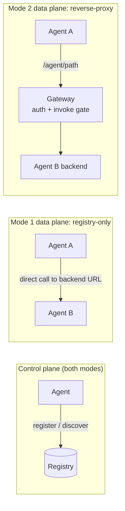
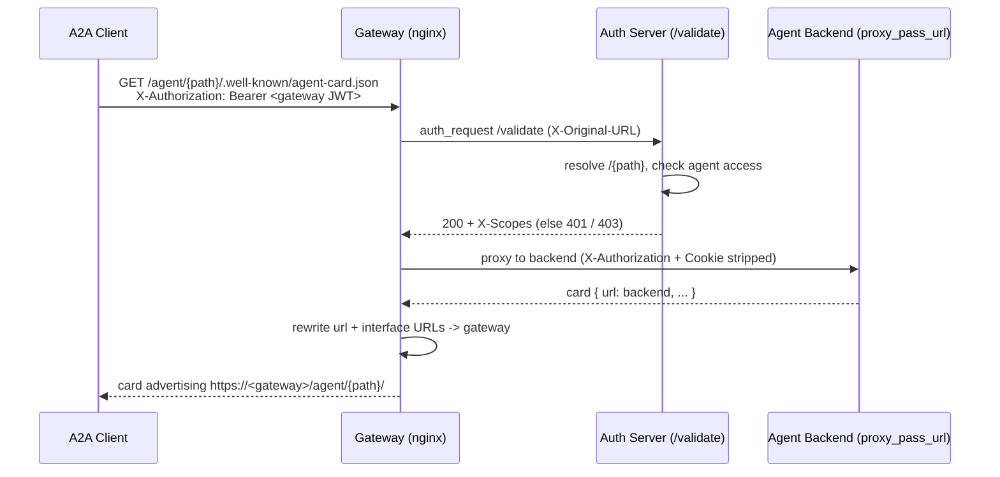
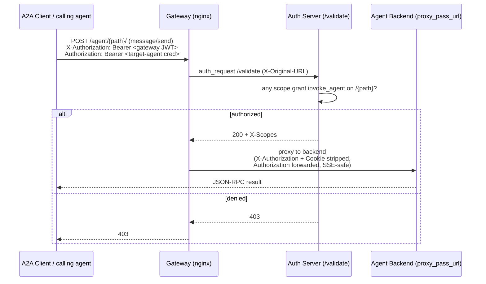

# Agent-to-Agent (A2A) Protocol Support

The MCP Gateway & Registry supports **Agent-to-Agent (A2A) communication**: AI agents register themselves, discover other agents they are allowed to see, and (optionally) call each other through the gateway. This creates a self-managed agent ecosystem with authentication and fine-grained access control.

This is the single guide for A2A. It covers the two operating modes, how to register and manage agents (CRUD via CLI or `curl`), how invoke access is granted, and how reverse-proxy routing works internally (with sequence diagrams). For the deep implementation reference, see the [A2A Protocol Integration design doc](design/a2a-protocol-integration.md).

## Two Modes: Registry-Only vs. Reverse-Proxy

A2A runs in one of two modes. Both share the same registration, discovery, and access-control machinery; they differ only in whether the gateway sits in the agent-to-agent **data path**.

### Mode 1 — Registry-only discovery (default)

The registry is a discovery and validation service only:

- Agents register their capabilities and metadata.
- Agents discover other agents they have permission to see.
- Agents then talk to each other **directly**, using the URL returned by discovery.
- **The registry is not in the data path** — once two agents find each other, the registry is done.

This is the default and needs no extra configuration.

### Mode 2 — Reverse-proxy routing (opt-in)

The gateway sits in the data path and proxies A2A traffic the same way it proxies MCP servers:

- Each **enabled** agent gets authenticated nginx routes under `/agent/{path}`.
- The agent's real backend stays private; discovery advertises the gateway URL instead.
- Every call is authenticated and gated **per-agent** before it reaches the backend.

Turn it on with `A2A_REVERSE_PROXY_ENABLED=true` (requires `with-gateway` deployment mode). See [Reverse-Proxy Mode](#reverse-proxy-mode-routing-a2a-traffic-through-the-gateway) below for the full setup and how it works.



---

## Getting Started

### The token

All A2A operations are authenticated with a JWT. **This guide assumes you already have a token** (from the registry UI's "Get JWT Token" button, an M2M service account, or your IdP). Save it to a file named `.token` in your working directory:

```json
{ "access_token": "<your-jwt>" }
```

Both the CLI and `curl` examples below use that file. The token carries your IdP groups, which map to scopes that decide what you can do (see [Access Control](#access-control)).

### Register an agent with the CLI

```bash
# Register from a JSON card (see cli/examples/ for templates)
uv run python cli/agent_mgmt.py --token-file .token register cli/examples/code_reviewer_agent.json

# Enable it (agents register disabled by default)
uv run python cli/agent_mgmt.py --token-file .token toggle /code-reviewer true

# List agents visible to you
uv run python cli/agent_mgmt.py --token-file .token list
```

### Register an agent with curl

Everything the CLI does is a plain REST call to `/api/agents/*` through the gateway (port 80 / your registry URL):

```bash
TOKEN=$(jq -r .access_token .token)

curl -X POST "$REGISTRY_URL/api/agents/register" \
  -H "Authorization: Bearer $TOKEN" \
  -H "Content-Type: application/json" \
  -d @cli/examples/code_reviewer_agent.json
```

---

## CRUD and Discovery APIs

All endpoints are under `/api/agents` and require a `Bearer` token. Results are filtered by your permissions.

| Operation | Method + Path | CLI command |
|-----------|---------------|-------------|
| Register | `POST /api/agents/register` | `register <file.json>` |
| List | `GET /api/agents` | `list` |
| Get one | `GET /api/agents/{path}` | `get /path` |
| Update | `PUT /api/agents/{path}` | `update /path <file.json>` |
| Delete | `DELETE /api/agents/{path}` | `delete /path` |
| Enable/disable | `POST /api/agents/{path}/toggle` | `toggle /path true\|false` |
| Test reachability | `POST /api/agents/{path}/health` | `test /path` |
| Semantic discovery | `POST /api/agents/discover/semantic` | `search "<query>"` |

**CLI examples:**

```bash
CLI="uv run python cli/agent_mgmt.py --token-file .token"

$CLI get /code-reviewer
$CLI update /code-reviewer cli/examples/code_reviewer_agent.json
$CLI toggle /code-reviewer false        # disable without deleting
$CLI search "agent that reviews python for security issues"
$CLI delete /code-reviewer
```

**curl examples:**

```bash
TOKEN=$(jq -r .access_token .token)

# Get one agent
curl -H "Authorization: Bearer $TOKEN" "$REGISTRY_URL/api/agents/code-reviewer"

# Semantic discovery
curl -X POST "$REGISTRY_URL/api/agents/discover/semantic?query=code+review&max_results=5" \
  -H "Authorization: Bearer $TOKEN"

# Delete
curl -X DELETE "$REGISTRY_URL/api/agents/code-reviewer" \
  -H "Authorization: Bearer $TOKEN"
```

See [cli/examples/](../cli/examples/) for agent-card templates and [A2A Protocol Integration](design/a2a-protocol-integration.md#the-agent-card-machine-readable-profile) for the full agent-card field reference.

---

## Access Control

Access is driven by **scopes** attached to your IdP groups. Each scope has a `server_access` array holding both MCP-server rules and agent rules; an agent rule is `{"agent": "<path|*>", "actions": [...]}` — the `agent` key is the resource identifier and `actions` is the allowed-verb list.

Agent actions:

- `list_agents`, `get_agent` — see agents in listings / read a card
- `publish_agent`, `modify_agent`, `delete_agent` — CRUD
- `invoke_agent` — call the agent through the gateway (reverse-proxy mode only)

The scope files are the source of truth. Do not hand-edit shapes in this doc; refer to the JSON:

- **Admin (all agents):** [`scripts/registry-admins.json`](../scripts/registry-admins.json) grants `{"agent": "*", "actions": ["list_agents", "get_agent", "publish_agent", "modify_agent", "delete_agent", "invoke_agent"]}`.
- **Least privilege (specific agents):** [`cli/examples/public-mcp-users.json`](../cli/examples/public-mcp-users.json) grants per-agent rules such as `{"agent": "/flight-booking", "actions": ["list_agents", "get_agent", "invoke_agent"]}`.

A caller may invoke an agent only if one of its scopes has an `agent` rule that matches the path (exact, or `*`/`all`) **and** whose `actions` include `invoke_agent` (or an `all`/`*` wildcard). For the full rule format see [Scopes Management](scopes-mgmt.md#agent-rule); for complete scope examples see [Authentication](auth.md#scope-configuration).

Agents also honor **visibility** (`public`, `private`, `group-restricted`) as a second filter on top of scopes.

---

## Reverse-Proxy Mode: Routing A2A Traffic Through the Gateway

In the default mode the registry hands a discovering agent the target's *direct* URL and steps aside. **Reverse-proxy mode** instead puts the gateway in the data path, so every agent-card fetch and JSON-RPC call flows through the gateway with authentication and per-agent access control, and the agent's real backend stays private.

### What changes when it is on

- Each **enabled** agent gets two `auth_request`-guarded nginx locations: an exact-match agent-card route (`/agent/{path}/.well-known/agent-card.json`) and a prefix JSON-RPC/SSE route (`/agent/{path}/`).
- At registration the registry stores your real backend in **`proxy_pass_url`** and rewrites the advertised **`url`** to the gateway (`{REGISTRY_URL}/agent/{path}/`). This mirrors the MCP-server backend/advertised split. The backend is **redacted from non-admin reads**, so discovering agents only ever get the gateway URL.
- Invocation is gated per agent at `/validate`: the caller needs an `invoke_agent` grant for that agent path.
- The caller's gateway token travels in **`X-Authorization`** (stripped at egress); the target agent's own credential travels in **`Authorization`** (forwarded end to end). The gateway never brokers credentials to the backend.

### Prerequisites

- **`with-gateway` deployment mode.** Reverse-proxy mode needs a gateway to proxy through, so it is force-disabled in `registry-only` deployments (the registry logs a startup banner, generates no `/agent/*` blocks, and stores `url == proxy_pass_url`).
- **Network reachability + SSRF allowlist.** The gateway must reach each agent backend. Backends usually live on internal networks (Docker service names, ECS Service Connect names, in-cluster ClusterIPs), which the SSRF guard blocks by default. Allow them with `SSRF_ALLOWED_HOSTS` (preferred, least privilege) and/or `SSRF_ALLOWED_CIDRS`. Without this, backends are marked unhealthy and proxying fails.

### Enabling it on each surface

The same three settings exist on all three deployment surfaces; the enable flag defaults to `false` everywhere. All are indexed in the [Unified Parameter Reference](unified-parameter-reference.md#group-31--a2a-reverse-proxy-mode).

**Docker Compose (`.env`):**

```bash
A2A_REVERSE_PROXY_ENABLED=true
SSRF_ALLOWED_HOSTS=flight-booking-agent,travel-assistant-agent
SSRF_ALLOWED_CIDRS=172.18.0.0/16
```

**Terraform / ECS (`terraform.tfvars`):**

```hcl
a2a_reverse_proxy_enabled = true
ssrf_allowed_hosts = "flight-booking-agent.mcp-gateway-v2.local"
ssrf_allowed_cidrs = ""
```

**Helm / EKS (`values.yaml`, stack chart uses `registry.app.*`):**

```yaml
registry:
  app:
    a2aReverseProxyEnabled: true
    ssrfAllowedHosts: ""
    ssrfAllowedCidrs: "10.100.0.0/16"
```

### How discovery works (card rewrite)

When a client fetches an agent card through the gateway, the gateway validates access, proxies to the private backend, and rewrites the card's URLs to point back at itself so the client's follow-up JSON-RPC calls also route through the gateway.



The rewrite (a Lua `body_filter`) preserves empty-array card fields and honors `X-Cloudfront-Forwarded-Proto` so the advertised scheme is correct (`https`) even when CloudFront/ALB terminate TLS and forward over plain HTTP.

### How invocation works (per-agent FGAC)

When a client calls the agent through the gateway, the gateway enforces the `invoke_agent` grant, strips the gateway token, forwards the target-agent credential, and proxies to the backend.



**Egress trust model:** the gateway is a policy gate, never a credential broker. `X-Authorization` carries the caller's gateway token (authenticated, then stripped so it never reaches the registrant-controlled backend); `Authorization` carries the target agent's own credential (forwarded untouched). As defense-in-depth, `/validate` rejects a request whose `Authorization` duplicates the `X-Authorization` value.

### Verifying it works

```bash
CLI="uv run python cli/agent_mgmt.py --token-file .token"
TOKEN=$(jq -r .access_token .token)

# 1. Register + enable an agent (its url is rewritten to the gateway).
$CLI register cli/examples/flight_booking_agent_card.json
$CLI toggle /flight-booking true

# 2. As an admin, confirm the advertised url is the gateway and proxy_pass_url is the backend.
$CLI get /flight-booking | jq '{url, proxy_pass_url}'

# 3. Fetch the agent card THROUGH the gateway (card url should point back at the gateway).
curl -H "X-Authorization: Bearer $TOKEN" \
  "$REGISTRY_URL/agent/flight-booking/.well-known/agent-card.json" | jq .url
```

---

## Agent Card and Metadata

An agent card is the JSON document you register. Minimal example:

```json
{
  "protocol_version": "1.0",
  "name": "Code Reviewer Agent",
  "description": "Reviews code for quality and best practices",
  "path": "/code-reviewer",
  "url": "https://agent.example.com",
  "skills": [
    {
      "id": "review-python",
      "name": "Python Code Review",
      "description": "Reviews Python code for style and correctness"
    }
  ],
  "security_schemes": {"bearer": {"type": "http", "scheme": "bearer"}},
  "tags": ["code-review", "qa"],
  "visibility": "public",
  "trust_level": "community"
}
```

Agents support an optional `metadata` object (any JSON-serializable data) for organization, compliance, and integration tracking. Metadata is included in semantic search, so you can query by team, owner, cost center, region, and so on:

```bash
uv run python cli/agent_mgmt.py --token-file .token search "team:data-science agents"
```

See [cli/examples/](../cli/examples/) for full templates and [A2A Protocol Integration](design/a2a-protocol-integration.md#the-agent-card-machine-readable-profile) for every field.

---

## Related Documentation

- **[A2A Protocol Integration (Design)](design/a2a-protocol-integration.md)** — full data-path design, agent-card reference, and reverse-proxy internals
- **[Scopes Management](scopes-mgmt.md)** — scope file format, including the agent rule
- **[Authentication](auth.md)** — how tokens, groups, and scopes fit together
- **[Unified Parameter Reference](unified-parameter-reference.md#group-31--a2a-reverse-proxy-mode)** — reverse-proxy config on every deployment surface
- **[CLI Reference](cli.md)** — the full command-line interface

---

**Part of the [Agentic Community](https://github.com/agentic-community) - Building the future of AI agent ecosystems.**
