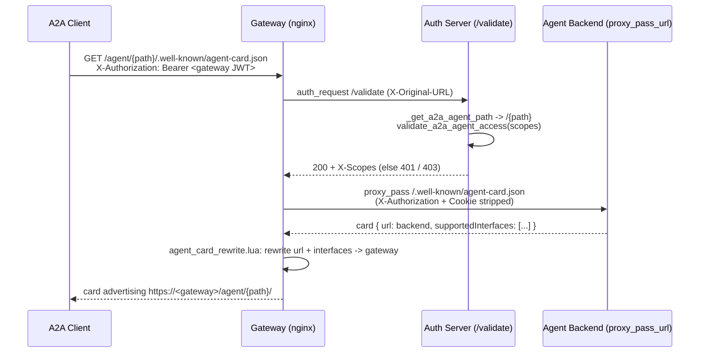

# A2A Protocol Integration: Comprehensive Developer Guide

This guide documents the Agent-to-Agent (A2A) protocol implementation in the MCP Gateway Registry. Rather than a specification, this is a practical guide to understanding how the system works today, how agents register themselves, how discovery works, and how access control is enforced across the entire stack.

## Table of Contents

1. [What We Built](#what-we-built)
2. [The Big Picture: Request Flow](#the-big-picture-request-flow)
3. [How Requests Get Authenticated](#how-requests-get-authenticated)
4. [The Agent Card: Machine-Readable Profile](#the-agent-card-machine-readable-profile)
5. [CRUD Operations: Agents Registering Themselves](#crud-operations-agents-registering-themselves)
6. [Discovery: How Agents Find Other Agents](#discovery-how-agents-find-other-agents)
7. [Access Control: Three-Tier Permission System](#access-control-three-tier-permission-system)
8. [The Code: Where Everything Lives](#the-code-where-everything-lives)
9. [Reverse-Proxy Mode: Proxying A2A Traffic](#reverse-proxy-mode-proxying-a2a-traffic)

---

## What We Built

The MCP Gateway Registry supports Agent-to-Agent (A2A) communication in **two modes**. Both share the same registration, discovery, and access-control machinery; they differ only in whether the gateway sits in the agent-to-agent *data path*.

**Mode 1 — Registry-only discovery (default).** The registry is a discovery and validation service only:

- Agents register their capabilities and metadata with the registry
- Agents discover other agents they have permission to access
- Agents then communicate **directly** with each other using the URLs returned by the registry
- **The registry itself is NOT in the agent-to-agent data path** — once agents find each other, they talk peer-to-peer with no registry intermediation

**Mode 2 — Reverse-proxy mode (opt-in, `A2A_REVERSE_PROXY_ENABLED=true`).** The gateway *does* sit in the data path, proxying A2A traffic (agent-card discovery and JSON-RPC) the same way it proxies MCP servers:

- Each **enabled** agent gets proxied nginx routes under `/agent/{path}`, guarded by the `auth_request /validate` subrequest
- The agent's real backend stays private (`proxy_pass_url`); discovery advertises the gateway `url` instead
- Every call is authenticated and gated per-agent (`invoke_agent` FGAC) before it reaches the backend

The two modes are not mutually exclusive per request so much as a deployment-wide choice: registry-only discovery always works; reverse-proxy mode additionally stands up proxied routes for registered agents. Reverse-proxy mode requires `with-gateway` deployment mode and is force-disabled in registry-only deployments (there is no gateway to proxy through). See [Reverse-Proxy Mode: Proxying A2A Traffic](#reverse-proxy-mode-proxying-a2a-traffic) for the full data-path design.

The rest of this guide (registration, the agent card, CRUD, discovery, access control) applies to **both** modes. Where reverse-proxy mode changes behavior — the advertised `url`, the `proxy_pass_url` backend split, per-agent invoke gating — it is called out inline and detailed in the final section.

### Why This Matters

Building an autonomous agent ecosystem requires that agents be able to find each other without a central orchestrator. This architecture enables:

- **Decentralized coordination**: Agents discover and contact each other directly
- **Scalability**: No bottleneck at the registry for agent-to-agent communication
- **Security**: Each agent maintains its own authentication and authorization
- **Autonomy**: Agents can operate independently after discovery

---

## The Big Picture: Request Flow

When an agent wants to register or discover other agents, here's the complete journey of a request:

```
Agent (AI Code)
    ↓
M2M Token (from Keycloak Service Account)
    ↓
[Port 80 - Nginx Reverse Proxy]
    ↓
[Auth Validation]
Nginx calls auth-server:/validate
Returns groups and scopes
    ↓
[FastAPI Routes]
/api/agents/register
/api/agents
/api/agents/{path}
/api/agents/discover/semantic
etc.
    ↓
[Authorization Enforcement]
Check if user has permission for requested action
Filter results based on access control
    ↓
[Business Logic]
Registry Services (agent_service.py)
File-based persistence (agent_state.json)
DocumentDB vector search
    ↓
[Response]
Agent cards, discovery results, or error
```

### The Key Difference from MCP

The flow above is the **control plane** (register / discover), and it is identical in both modes. What differs is the **data plane** — the actual agent-to-agent call after discovery:

```
MCP Request Flow (always proxied):
Agent → Nginx → Auth → FastAPI → Gateway Proxy → MCP Server → Agent

A2A control plane (register/discover, both modes):
Agent → Nginx → Auth → FastAPI → Registry Service
         ↓ Returns: Agent Card + URL

A2A data plane, Mode 1 (registry-only, default):
Agent ← [agents communicate directly, registry is out of the path] → Other Agent
   (discovery returns the agent's direct backend URL)

A2A data plane, Mode 2 (reverse-proxy, opt-in):
Agent → Nginx (/agent/{path}) → Auth (/validate: invoke_agent) → Gateway Proxy → Agent Backend
   (discovery returns the gateway URL; backend URL is stored privately in proxy_pass_url)
```

In Mode 2 the A2A data path looks just like the MCP data path: every call is authenticated and gated at the gateway before reaching the backend.

---

## How Requests Get Authenticated

Every request to the A2A agent API must include a valid JWT token from Keycloak. Here's the authentication journey:

### 1. Token Generation (M2M Service Account)

The `mcp-gateway-m2m` Keycloak service account generates tokens that are used for all A2A operations:

```bash
# Service Account Details
Client ID: mcp-gateway-m2m
Service User: service-account-mcp-gateway-m2m
Token File: .oauth-tokens/ingress.json (generated by credentials-provider/generate_creds.sh)
TTL: 5 minutes (expiration is critical)
```

When a token is generated, it contains:

```json
{
  "exp": 1761942660,
  "iat": 1761942360,
  "iss": "http://localhost:8080/realms/mcp-gateway",
  "sub": "user-id-uuid",
  "typ": "Bearer",
  "azp": "mcp-gateway-m2m",
  "client_id": "mcp-gateway-m2m",
  "preferred_username": "service-account-mcp-gateway-m2m",
  "groups": [
    "mcp-servers-unrestricted",
    "a2a-agent-admin"
  ],
  "scope": "profile email mcp-servers-unrestricted/read mcp-servers-unrestricted/execute a2a-agent-admin"
}
```

The critical fields are:
- `groups`: List of Keycloak groups the account belongs to (controls what agents it can access)
- `exp`: Expiration timestamp (checked for token validity)

### 2. Nginx Reverse Proxy Intercepts Request

Nginx runs on port 80 and intercepts all requests to `/api/` paths. It extracts the JWT and calls the auth-server to validate it:

```
curl -H "Authorization: Bearer $TOKEN" \
  http://localhost/api/agents/register

Nginx intercepts → Calls auth-server:/validate
```

The auth-server validates the JWT and maps the groups in the token to internal scope names.

### 3. Auth-Server Validates and Maps Groups

The auth-server decodes the JWT, extracts the groups, and looks them up in the `mcp_scopes` collection in DocumentDB (seeded from JSON scope files in `scripts/`):

```yaml
# Example group mapping from the mcp_scopes collection
mcp-registry-admin:
- mcp-registry-admin
- mcp-servers-unrestricted/read
- mcp-servers-unrestricted/execute

a2a-agent-admin:
- a2a-agent-admin  # Implicit (service accounts have special mapping)
```

The auth-server returns:
```json
{
  "groups": ["mcp-servers-unrestricted", "a2a-agent-admin"],
  "scopes": ["mcp-servers-unrestricted/read", "mcp-servers-unrestricted/execute", "a2a-agent-admin"],
  "username": "service-account-mcp-gateway-m2m"
}
```

### 4. Nginx Forwards to FastAPI with Scopes

Nginx adds a header with the scopes and forwards the request:

```
X-Scopes: a2a-agent-admin, mcp-servers-unrestricted/read, mcp-servers-unrestricted/execute
Authorization: Bearer $TOKEN
```

### 5. FastAPI Endpoint Checks Permissions

The FastAPI endpoint reads the scopes and enforces permissions:

```python
@router.post("/agents/register")
async def register_agent(
    request: Request,
    agent_card: AgentCard,
    user_context: dict = Depends(enhanced_auth)
):
    # Check if user has a2a-agent-admin scope
    if "a2a-agent-admin" not in user_context.get("scopes", []):
        raise HTTPException(status_code=403, detail="Not authorized")

    # Proceed with registration
```

### 6. Agent State Persisted

The registered agent is saved to `registry/agents/agent_state.json` in the format:

```json
{
  "agents": {
    "/code-reviewer": {
      "name": "Code Reviewer Agent",
      "path": "/code-reviewer",
      "url": "https://agent.example.com/code-reviewer",
      "protocol_version": "1.0",
      "is_enabled": true,
      "registered_at": "2025-11-09T10:30:00Z",
      "registered_by": "service-account-mcp-gateway-m2m",
      "visibility": "public"
    }
  }
}
```

### Token Validation in CLI

The CLI (`cli/agent_mgmt.py`) validates tokens before making requests. It checks:

1. **Token exists**: `.oauth-tokens/ingress.json` file is present
2. **Token is not expired**: Decodes JWT payload, checks `exp` claim against current timestamp
3. **Token has correct groups**: Verifies `groups` claim includes required groups

This ensures requests fail fast with clear messages if credentials are stale (tokens expire in 5 minutes).

---

## The Agent Card: Machine-Readable Profile

An agent card is a JSON document that describes what an agent does, how to reach it, and what capabilities it offers. The registry stores these cards and returns them during discovery.

### Complete Agent Card Structure

```json
{
  "protocol_version": "1.0",
  "name": "Code Reviewer Agent",
  "description": "Analyzes Python and JavaScript code for bugs, style issues, and security vulnerabilities",
  "url": "https://agents.example.com/code-reviewer",
  "version": "2.1.0",
  "provider": "Acme Corp",

  "skills": [
    {
      "id": "review-python-code",
      "name": "Review Python Code",
      "description": "Performs static analysis on Python source code",
      "parameters": {
        "type": "object",
        "properties": {
          "code": {
            "type": "string",
            "description": "Python source code to review"
          },
          "strict_mode": {
            "type": "boolean",
            "default": false,
            "description": "Enable strict analysis rules"
          }
        },
        "required": ["code"]
      },
      "tags": ["python", "code-review", "security"]
    },
    {
      "id": "review-javascript-code",
      "name": "Review JavaScript Code",
      "description": "Performs static analysis on JavaScript source code",
      "parameters": {
        "type": "object",
        "properties": {
          "code": { "type": "string" },
          "strict_mode": { "type": "boolean", "default": false }
        },
        "required": ["code"]
      },
      "tags": ["javascript", "code-review", "security"]
    }
  ],

  "security_schemes": {
    "bearer": {
      "type": "http",
      "scheme": "bearer",
      "bearer_format": "JWT"
    }
  },
  "security": [{"bearer": []}],

  "streaming": false,
  "path": "/code-reviewer",
  "tags": [
    "code-review",
    "security",
    "static-analysis"
  ],
  "is_enabled": true,
  "num_stars": 0,
  "license": "MIT",
  "visibility": "public",
  "allowed_groups": [],
  "trust_level": "community",
  "registered_at": "2025-11-09T10:30:00Z",
  "registered_by": "service-account-mcp-gateway-m2m",
  "updated_at": "2025-11-09T10:35:00Z"
}
```

### Field Descriptions

**Core A2A Fields** (required):
- `protocol_version`: A2A protocol version (currently "1.0")
- `name`: Human-readable agent name
- `description`: What the agent does
- `url`: The URL other agents use to reach this agent after discovery. In **registry-only mode** this is the agent's direct backend. In **reverse-proxy mode** the registry rewrites it at registration time to the gateway address (`{REGISTRY_URL}/agent/{path}/`) and moves the real backend to `proxy_pass_url` (see below).
- `proxy_pass_url` (reverse-proxy mode only): the agent's real private backend that the gateway proxies to. Written by the registry at registration time, read by the nginx generator / health checker / security scanner, and **redacted from non-admin reads** (single-agent GET and discovery) — exactly like the MCP-server backend-URL split. For legacy agents registered before reverse-proxy mode existed, this is absent and consumers fall back to `url`.

**Capabilities**:
- `skills`: List of capabilities the agent offers. Each skill has:
  - `id`: Unique identifier within the agent
  - `name`: Human-readable name
  - `description`: What the skill does
  - `parameters`: JSON Schema defining input parameters
  - `tags`: Categorization for discovery

**Security**:
- `security_schemes`: How to authenticate with the agent (bearer, OAuth2, etc.)
- `security`: Which schemes are required
- `trust_level`: Verification status (unverified, community, verified, trusted)

**Registry Metadata**:
- `path`: Registry path (like `/code-reviewer`)
- `visibility`: Who can see it (public, private, group-restricted)
- `is_enabled`: Whether it's active in the registry
- `registered_at`: When it was registered
- `registered_by`: Which service account registered it

### Why the Agent Card Matters

The agent card is the contract between agents. When Agent B discovers Agent A, it gets the agent card which tells it:
- How to reach Agent A (`url`)
- What Agent A can do (`skills`)
- How to authenticate with Agent A (`security_schemes`)
- Whether it should trust Agent A (`trust_level`)

---

## CRUD Operations: Agents Registering Themselves

All CRUD (Create, Read, Update, Delete) operations happen through REST API endpoints. Every operation requires authentication and goes through the permission check.

### Creating: POST /api/agents/register

An agent registers itself by POSTing a card to the registry:

```bash
curl -X POST http://localhost/api/agents/register \
  -H "Authorization: Bearer $TOKEN" \
  -H "Content-Type: application/json" \
  -d @agent-card.json
```

**What Happens**:

1. **Nginx** receives request, validates JWT, calls auth-server
2. **Auth-server** maps groups to scopes, returns `a2a-agent-admin` scope
3. **Nginx** forwards request with `X-Scopes: a2a-agent-admin` header
4. **FastAPI endpoint** checks if scopes include `a2a-agent-admin`
5. **agent_routes.py** validates the agent card using `agent_validator.py`:
   - Schema validation (Pydantic)
   - Unique path check
   - Skills have unique IDs
   - Security schemes are properly configured
6. **agent_service.py** saves to `agent_state.json`
7. **Search service** indexes the agent for semantic search
8. **Response**: 201 Created with registered agent info

**Success Response**:
```json
{
  "message": "Agent registered successfully",
  "agent": {
    "name": "Code Reviewer Agent",
    "path": "/code-reviewer",
    "url": "https://agents.example.com/code-reviewer",
    "num_skills": 2,
    "registered_at": "2025-11-09T10:30:00Z",
    "is_enabled": false
  }
}
```

**Error Responses**:
- 400 Bad Request: Invalid agent card format
- 409 Conflict: Agent path already exists
- 403 Forbidden: User lacks `a2a-agent-admin` scope
- 422 Unprocessable Entity: Validation failed

### Reading: GET /api/agents/{path} and GET /api/agents

**Get Single Agent**:
```bash
curl -H "Authorization: Bearer $TOKEN" \
  http://localhost/api/agents/code-reviewer
```

Returns the complete agent card (if user has permission).

**List All Agents**:
```bash
curl -H "Authorization: Bearer $TOKEN" \
  http://localhost/api/agents
```

**What Happens**:
1. Auth checks what groups the user belongs to
2. Loads all agents from `agent_state.json`
3. **Filters by access control**: Only returns agents the user is authorized to see
4. Returns list with summaries

Example: If user is in `registry-users-lob1` group, they only see agents in their scope (`/code-reviewer`, `/test-automation`).

### Updating: PUT /api/agents/{path}

An agent can update its own card:

```bash
curl -X PUT http://localhost/api/agents/code-reviewer \
  -H "Authorization: Bearer $TOKEN" \
  -H "Content-Type: application/json" \
  -d @updated-card.json
```

**What Happens**:
1. **Check permissions**: User must have `modify_agent` scope for this path
2. **Validate new card**: Same validation as registration
3. **Update in storage**: Modify `agent_state.json`
4. **Re-index in search**: Update semantic search index
5. **Update timestamp**: Set `updated_at` to current time
6. **Return**: Updated agent card

### Deleting: DELETE /api/agents/{path}

Remove an agent from the registry:

```bash
curl -X DELETE http://localhost/api/agents/code-reviewer \
  -H "Authorization: Bearer $TOKEN"
```

**What Happens**:
1. **Check permissions**: User must have `delete_agent` scope
2. **Remove from storage**: Delete from `agent_state.json`
3. **Remove from search index**: Delete from semantic search index
4. **Return**: 204 No Content or success message

### Toggling: POST /api/agents/{path}/toggle

Enable or disable an agent without deleting it:

```bash
curl -X POST http://localhost/api/agents/code-reviewer/toggle?enabled=true \
  -H "Authorization: Bearer $TOKEN"
```

**What Happens**:
1. **Check permissions**: User must have modify permissions
2. **Toggle state**: Set `is_enabled` to true or false
3. **Update search index**: Enabled status affects search results
4. **Return**: Updated agent info

---

## Discovery: How Agents Find Other Agents

Once agents are registered, other agents can discover them through two mechanisms: semantic search and direct queries.

### Semantic Search: POST /api/agents/discover/semantic

An agent asks a natural language question to find other agents:

```bash
curl -X POST http://localhost/api/agents/discover/semantic \
  -H "Authorization: Bearer $TOKEN" \
  -H "Content-Type: application/json" \
  -d '{
    "query": "I need an agent that can review Python code for security vulnerabilities",
    "max_results": 5,
    "entity_types": ["a2a_agent"]
  }'
```

**How It Works**:

1. **Query Embedding**: The natural language query is converted to a vector using an embedding model
2. **Vector Search**: The vector is compared against all agent cards stored in the search index
3. **Ranking**: Results ranked by similarity score
4. **Filtering**: Only agents visible to this user (based on groups and visibility)
5. **Return**: Agents with `relevance_score`

**Response**:
```json
{
  "entities": [
    {
      "entity_type": "a2a_agent",
      "name": "Code Reviewer Agent",
      "path": "/code-reviewer",
      "description": "Analyzes Python and JavaScript code...",
      "url": "https://agents.example.com/code-reviewer",
      "relevance_score": 0.92,
      "skills": ["review-python-code", "review-javascript-code"],
      "trust_level": "community"
    }
  ],
  "query": "I need an agent that can review Python code..."
}
```

### How Search Indexing Works

When an agent is registered, the registry creates an embedding for it:

```python
# From agent_service.py
def _get_agent_text_for_embedding(agent_card):
    """Prepare agent card for semantic search"""
    name = agent_card["name"]
    description = agent_card["description"]

    # Extract skill information
    skills_text = "\n".join([
        f"{s['name']}: {s['description']}"
        for s in agent_card.get("skills", [])
    ])

    # Combine all searchable text
    text = f"""
    Name: {name}
    Description: {description}
    Skills: {skills_text}
    Tags: {', '.join(agent_card.get('tags', []))}
    """

    return text.strip()

# This text is embedded and stored in the search index
# When someone searches, their query is embedded and compared
```

The search index maintains metadata about each entity:

```json
{
  "id": 42,
  "entity_type": "a2a_agent",
  "path": "/code-reviewer",
  "text_for_embedding": "Name: Code Reviewer...",
  "full_entity_info": { /* complete agent card */ },
  "is_enabled": true
}
```

### Direct API Queries

For more precise queries, agents can also search using filters:

```bash
curl -X POST http://localhost/api/agents/discover \
  -H "Authorization: Bearer $TOKEN" \
  -H "Content-Type: application/json" \
  -d '{
    "skills": ["review-python-code"],
    "tags": ["security", "python"],
    "max_results": 10
  }'
```

---

## Access Control: Three-Tier Permission System

Access control is enforced at three levels: UI scopes, group mappings, and individual agent permissions. All three work together to determine what an authenticated user can do.

### Tier 1: UI-Scopes (High-Level Actions)

The `UI-Scopes` section of the scope configuration (the `mcp_scopes` collection in DocumentDB) defines what high-level actions each group can perform:

```yaml
UI-Scopes:
  mcp-registry-admin:
    list_agents: [all]
    get_agent: [all]
    publish_agent: [all]
    modify_agent: [all]
    delete_agent: [all]

  registry-users-lob1:
    list_agents:
    - /code-reviewer
    - /test-automation
    get_agent:
    - /code-reviewer
    - /test-automation
    publish_agent:
    - /code-reviewer
    - /test-automation
    modify_agent:
    - /code-reviewer
    - /test-automation
    delete_agent:
    - /code-reviewer
    - /test-automation
```

This says:
- `mcp-registry-admin` can list ALL agents
- `registry-users-lob1` can ONLY list `/code-reviewer` and `/test-automation`

### Tier 2: Group Mappings (Keycloak to Internal Scopes)

The `group_mappings` section maps Keycloak groups to internal scope names:

```yaml
group_mappings:
  mcp-registry-admin:
  - mcp-registry-admin
  - mcp-servers-unrestricted/read
  - mcp-servers-unrestricted/execute

  registry-users-lob1:
  - registry-users-lob1
```

When a user authenticates with Keycloak, their JWT includes groups. The auth-server uses this mapping to determine which internal scopes apply.

### Tier 3: `server_access` Rules (Detailed Permissions)

Each scope document in the `mcp_scopes` collection has a `server_access` array holding the detailed grants. **Agent grants and MCP-server grants share this one array and use the same rule shape** — an identifier key plus a verb list:

- an MCP-server rule is `{"server": "<name|*>", "methods": [...], "tools": [...]}`
- an agent rule is `{"agent": "<path|*>", "actions": [...]}`

`agent` mirrors `server` (the resource identifier) and `actions` mirrors `methods` (the allowed verbs). The two rule types coexist because MCP scope resolution only inspects `server`-keyed entries and the A2A validator only inspects `agent`-keyed entries.

A least-privilege example (from `cli/examples/public-mcp-users.json`) granting invoke on two specific agents:

```json
"server_access": [
  {"server": "context7", "methods": ["initialize", "tools/list", "tools/call"], "tools": ["*"]},
  {"agent": "/flight-booking", "actions": ["list_agents", "get_agent", "invoke_agent"]},
  {"agent": "/flight-booking-agent", "actions": ["list_agents", "get_agent", "invoke_agent"]}
]
```

An admin example (from `scripts/registry-admins.json`) uses the `*` wildcard for the agent identifier:

```json
"server_access": [
  {"server": "*", "methods": ["all"], "tools": ["all"]},
  {"agent": "*", "actions": ["list_agents", "get_agent", "publish_agent", "modify_agent", "delete_agent", "invoke_agent"]}
]
```

Agent actions are: `list_agents`, `get_agent`, `publish_agent`, `modify_agent`, `delete_agent`, and (reverse-proxy mode) `invoke_agent`.

> **Shape matters.** The agent rule must be a direct `{"agent": ..., "actions": [...]}` entry in `server_access`. An older nested form (`{"agents": {"actions": [{"action": ..., "resources": [...]}]}}`) is **silently dropped** by the scope flattener (`_flatten_server_access`) and grants nothing. Always use the flat `{agent, actions}` shape.

### How Permission Checking Works in Code

When a request comes in to list agents:

```python
@router.get("/agents")
async def list_agents(
    request: Request,
    user_context: dict = Depends(enhanced_auth)
):
    # user_context contains:
    # {
    #   "username": "service-account-mcp-gateway-m2m",
    #   "groups": ["mcp-registry-admin"],
    #   "scopes": ["mcp-registry-admin", "mcp-servers-unrestricted/read", ...]
    # }

    # Load all agents
    agents = agent_service.load_agents()

    # Filter based on scopes
    accessible_agents = _filter_agents_by_access(
        agents,
        user_context
    )

    return {"agents": accessible_agents}

def _filter_agents_by_access(agents, user_context):
    """Filter agents based on user's access permissions"""

    groups = user_context.get("groups", [])
    scopes = user_context.get("scopes", [])

    # Admin can see all
    if "mcp-registry-admin" in groups:
        return agents

    # LOB1 can only see LOB1 agents
    if "registry-users-lob1" in groups:
        return [a for a in agents if a["path"] in [
            "/code-reviewer",
            "/test-automation"
        ]]

    # LOB2 can only see LOB2 agents
    if "registry-users-lob2" in groups:
        return [a for a in agents if a["path"] in [
            "/data-analysis",
            "/security-analyzer"
        ]]

    # Unknown group sees nothing
    return []
```

### Agent Visibility Levels

Beyond group-based access, agents also have visibility settings:

- **public**: Visible to all authenticated users
- **private**: Only visible to owner and admins
- **group-restricted**: Only visible to specific groups

The filtering considers both the user's groups and the agent's visibility setting.

---

## The Code: Where Everything Lives

This section maps the implementation to actual files and shows how the pieces fit together.

### API Routes (registry/api/agent_routes.py - 838 lines)

This file defines 8 REST API endpoints:

```python
@router.post("/agents/register")
async def register_agent(request: Request, agent_card: AgentCard):
    """Register a new agent (requires a2a-agent-admin scope)"""
    # 1. Check user has a2a-agent-admin scope
    # 2. Validate agent card using agent_validator
    # 3. Check path is unique
    # 4. Save to agent_state.json
    # 5. Index in search
    # 6. Return 201 Created

@router.get("/agents")
async def list_agents(request: Request):
    """List agents (filtered by user permissions)"""
    # 1. Load all agents
    # 2. Filter by user's groups and visibility
    # 3. Return summary list

@router.get("/agents/{path}")
async def get_agent(request: Request, path: str):
    """Get complete agent card by path"""
    # 1. Check user has permission for this agent
    # 2. Load from agent_state.json
    # 3. Return full agent card

@router.put("/agents/{path}")
async def update_agent(request: Request, path: str, agent_card: AgentCard):
    """Update agent card (requires modify_agent scope for this path)"""
    # 1. Check user has modify_agent scope
    # 2. Validate new card
    # 3. Update agent_state.json
    # 4. Re-index in search
    # 5. Return updated card

@router.delete("/agents/{path}")
async def delete_agent(request: Request, path: str):
    """Delete agent (requires delete_agent scope for this path)"""
    # 1. Check user has delete_agent scope
    # 2. Remove from agent_state.json
    # 3. Remove from search index
    # 4. Return 204 No Content

@router.post("/agents/{path}/toggle")
async def toggle_agent(request: Request, path: str, enabled: bool):
    """Enable or disable agent"""
    # 1. Check user has modify_agent scope
    # 2. Update is_enabled flag
    # 3. Return updated agent info

@router.post("/agents/discover/semantic")
async def discover_agents_semantic(request: Request, query: DiscoveryQuery):
    """Semantic search for agents"""
    # 1. Embed the natural language query
    # 2. Search vector index
    # 3. Filter results by user permissions
    # 4. Return ranked results
```

### Business Logic (registry/services/agent_service.py - 695 lines)

This file handles all agent operations:

```python
class AgentService:
    """CRUD operations for agents"""

    def load_agents_and_state(self) -> dict:
        """Load all agents from agent_state.json"""
        # Returns: {"agents": {"/code-reviewer": {...}, ...}}

    def register_agent(self, agent_card: AgentCard) -> AgentCard:
        """Register a new agent"""
        # 1. Validate path is unique
        # 2. Generate registered_at timestamp
        # 3. Add to agent_state.json
        # 4. Return registered card

    def get_agent(self, path: str) -> AgentCard:
        """Get agent by path"""
        # Returns agent card or raises HTTPException(404)

    def update_agent(self, path: str, card: AgentCard) -> AgentCard:
        """Update existing agent"""
        # 1. Load current agent
        # 2. Merge updates
        # 3. Update agent_state.json
        # 4. Return updated card

    def delete_agent(self, path: str) -> None:
        """Delete agent by path"""
        # Remove from agent_state.json

    def toggle_agent(self, path: str, enabled: bool) -> AgentCard:
        """Enable or disable agent"""
        # Update is_enabled flag in agent_state.json

    def list_agents(self) -> List[AgentInfo]:
        """Get all agents as summaries"""
        # Returns list of simplified agent info
```

### Data Models (registry/schemas/agent_models.py - 603 lines)

Pydantic models for validation:

```python
class SecurityScheme(BaseModel):
    """How to authenticate with an agent"""
    type: str  # "apiKey", "http", "oauth2", "openIdConnect"
    scheme: Optional[str] = None
    in_: Optional[str] = None
    name: Optional[str] = None

class Skill(BaseModel):
    """A capability an agent offers"""
    id: str
    name: str
    description: str
    parameters: Optional[Dict[str, Any]] = None
    tags: List[str] = []

class AgentCard(BaseModel):
    """Complete agent profile"""
    protocol_version: str
    name: str
    description: str
    url: str  # Direct URL for peer-to-peer communication

    skills: List[Skill] = []
    security_schemes: Dict[str, SecurityScheme] = {}
    security: Optional[List[Dict[str, List[str]]]] = None

    path: str  # Registry path: /agents/code-reviewer
    visibility: str = "public"
    is_enabled: bool = False
    trust_level: str = "unverified"

    registered_at: Optional[datetime] = None
    registered_by: Optional[str] = None
    updated_at: Optional[datetime] = None
```

### Validation (registry/utils/agent_validator.py - 343 lines)

Ensures agent cards are valid:

```python
class AgentValidator:
    """Validate agent cards"""

    async def validate_agent_card(
        self,
        card: AgentCard,
        verify_endpoint: bool = True
    ) -> ValidationResult:
        """
        Validate agent card:
        - Schema validation (Pydantic)
        - Unique skill IDs
        - Valid security schemes
        - Endpoint reachability (optional)
        """
```

### Storage (registry/agents/agent_state.json)

Central file tracking all registered agents:

```json
{
  "agents": {
    "/code-reviewer": {
      "name": "Code Reviewer Agent",
      "path": "/code-reviewer",
      "url": "https://agents.example.com/code-reviewer",
      "protocol_version": "1.0",
      "is_enabled": true,
      "registered_at": "2025-11-09T10:30:00Z",
      "registered_by": "service-account-mcp-gateway-m2m"
    },
    "/test-automation": {
      "name": "Test Automation Agent",
      "path": "/test-automation",
      "url": "https://agents.example.com/test-automation",
      "protocol_version": "1.0",
      "is_enabled": true,
      "registered_at": "2025-11-09T10:31:00Z",
      "registered_by": "service-account-mcp-gateway-m2m"
    }
  }
}
```

### Search Integration (registry/search/service.py)

The search service indexes both MCP servers and agents using DocumentDB vector search:

```python
class SearchService:
    """Semantic search for MCP servers and A2A agents"""

    async def add_or_update_entity(
        self,
        entity_path: str,
        entity_info: Dict[str, Any],
        entity_type: str  # "mcp_server" or "a2a_agent"
    ):
        """Add or update entity in search index"""

        # Generate text for embedding
        if entity_type == "a2a_agent":
            text = self._get_agent_text_for_embedding(entity_info)
        else:
            text = self._get_server_text_for_embedding(entity_info)

        # Create embedding and add to index
        embedding = self.embedding_model.embed(text)
        self.search_index.add(embedding)

        # Store metadata
        metadata = {
            "entity_type": entity_type,
            "path": entity_path,
            "text_for_embedding": text,
            "full_entity_info": entity_info
        }
```

### Authentication (Keycloak + Auth Server)

The M2M service account `mcp-gateway-m2m` has:

```yaml
# Auto-assigned Keycloak groups (from keycloak/setup/init-keycloak.sh):
- mcp-servers-unrestricted  # Full MCP server access
- a2a-agent-admin           # Full agent management

# Mapped scopes (from the mcp_scopes collection in DocumentDB):
- mcp-servers-unrestricted/read
- mcp-servers-unrestricted/execute
- a2a-agent-admin
```

The token is generated every 5 minutes and stored in `.oauth-tokens/ingress.json`.

---

## Putting It All Together: Complete Request Example

Here's what happens when an agent registers itself:

**1. Agent Prepares Card**
```json
{
  "name": "Code Reviewer Agent",
  "description": "Reviews Python code",
  "url": "https://agents.example.com/code-reviewer",
  "path": "/code-reviewer",
  "protocol_version": "1.0",
  "skills": [
    {
      "id": "review-python",
      "name": "Review Python Code",
      "description": "Analyzes Python source code",
      "parameters": {"type": "object", "properties": {"code": {"type": "string"}}},
      "tags": ["python", "review"]
    }
  ],
  "security_schemes": {
    "bearer": {"type": "http", "scheme": "bearer", "bearer_format": "JWT"}
  },
  "security": [{"bearer": []}],
  "tags": "code-review,security"
}
```

**2. Agent Gets JWT Token**
```bash
$ ./credentials-provider/generate_creds.sh
# Generates .oauth-tokens/ingress.json with 5-minute TTL
```

**3. Agent POSTs to Registry**
```bash
curl -X POST http://localhost/api/agents/register \
  -H "Authorization: Bearer $TOKEN" \
  -H "Content-Type: application/json" \
  -d @agent-card.json
```

**4. Nginx Intercepts**
- Extracts JWT from Authorization header
- Calls auth-server:/validate with the token
- Auth-server decodes JWT and returns scopes

**5. Auth-Server Returns**
```json
{
  "username": "service-account-mcp-gateway-m2m",
  "groups": ["mcp-servers-unrestricted", "a2a-agent-admin"],
  "scopes": ["mcp-servers-unrestricted/read", "mcp-servers-unrestricted/execute", "a2a-agent-admin"]
}
```

**6. Nginx Forwards to FastAPI**
```
POST /api/agents/register HTTP/1.1
Authorization: Bearer $TOKEN
X-Scopes: mcp-servers-unrestricted/read,mcp-servers-unrestricted/execute,a2a-agent-admin
```

**7. FastAPI Endpoint Executes**
- Checks `a2a-agent-admin` in scopes ✓
- Validates agent card with Pydantic ✓
- Checks path `/code-reviewer` doesn't exist ✓
- Calls agent_service.register_agent()

**8. Agent Service Saves**
- Loads current agent_state.json
- Adds `/code-reviewer` entry
- Saves back to disk
- Returns registered agent

**9. Search Indexing**
- Generates embedding text from agent card
- Converts to vector using embedding model
- Adds to search index with metadata

**10. Response to Agent**
```json
{
  "message": "Agent registered successfully",
  "agent": {
    "name": "Code Reviewer Agent",
    "path": "/code-reviewer",
    "url": "https://agents.example.com/code-reviewer",
    "num_skills": 1,
    "registered_at": "2025-11-09T10:30:00Z",
    "is_enabled": false
  }
}
```

**11. Agent Enables Itself (Optional)**
```bash
curl -X POST http://localhost/api/agents/code-reviewer/toggle?enabled=true \
  -H "Authorization: Bearer $TOKEN"
```

Now the agent is discoverable by other agents and will appear in semantic searches.

---

## Reverse-Proxy Mode: Proxying A2A Traffic

By default the registry returns an agent's *direct* URL and steps aside (registry-only discovery, above). **Reverse-proxy mode** instead puts the gateway in the A2A data path — the same way it proxies MCP servers — so the agent backend stays private and clients reach it through a gateway path with auth on every call. It is opt-in and does not change registry-only discovery; when enabled, each **enabled** agent gets a proxied route under `/agent/{path}`.

### Enabling

Off by default. Set `A2A_REVERSE_PROXY_ENABLED=true` (settings field `a2a_reverse_proxy_enabled`). It also requires `with-gateway` deployment mode. These two conditions are combined in a single source of truth, `settings.a2a_reverse_proxy_effective` (`a2a_reverse_proxy_enabled AND nginx_updates_enabled`), which both the nginx generator and the registration-time URL rewrite consult.

**Registry-only mode force-disables routing (fail-safe):** in registry-only mode there is no gateway to proxy through, so the flag is inert even when set to `true`. When that combination is detected the registry logs a loud startup banner and:

- generates no `/agent/*` location blocks;
- stores registered agents with `url == proxy_pass_url` (no gateway rewrite — see below);
- returns the registry-only 503 for `/agent/*` paths.

### url vs proxy_pass_url (the backend/advertised split)

Reverse-proxy mode mirrors the MCP-server `url`/`proxy_pass_url` split so the agent backend stays private and discovery advertises the gateway:

- At **registration** (when `a2a_reverse_proxy_effective` and `supported_protocol == "a2a"`), the registry stores the registrant's real backend in **`proxy_pass_url`** and rewrites the advertised **`url`** to the gateway address `{REGISTRY_URL}/agent/{path}/`. The rewrite happens *after* endpoint validation, so the registration health check still probes the real backend.
- **Discovery, the nginx generator, the health checker, and the security scanner** all read the backend from `proxy_pass_url`, falling back to `url` for legacy agents registered before the flag existed (backwards compatible).
- **`proxy_pass_url` is redacted from non-admin reads** (single-agent GET and semantic discovery) via the shared `should_redact_backend_urls` helper — admin-only, exactly like the MCP-server backend-URL redaction. Discovery therefore returns only the gateway `url` to non-admins.

So a discovering agent always receives the gateway URL and routes back through the proxy; only admins ever see the private backend.

### Routes Per Agent

For an agent at path `flight-booking-agent`, the config generator emits two nginx locations, both guarded by the `auth_request /validate` subrequest (like MCP routes):

| Route | Purpose |
| --- | --- |
| `= /agent/flight-booking-agent/.well-known/agent-card.json` | Agent-card discovery (exact match) |
| `/agent/flight-booking-agent/` | A2A JSON-RPC endpoint (and SSE streaming) |

### Discovery Flow (Card Rewrite)



`agent_card_rewrite.lua` (a `body_filter`) makes the proxy transparent: it rewrites the card's top-level `url` and advertised interface URLs (`additionalInterfaces` for A2A 0.2.x, `supportedInterfaces` for proto/1.0 SDKs) from the backend origin to the gateway, so the client's JSON-RPC calls return through the proxy. A companion `header_filter` clears `Content-Length` since the body changes.

**Scheme behind a TLS-terminating proxy:** the advertised URL's scheme is chosen from, in order, `X-Cloudfront-Forwarded-Proto`, then `X-Forwarded-Proto`, then `ngx.var.scheme` (only the exact values `http`/`https` are accepted). This matters when CloudFront terminates TLS and forwards to the ALB over plain HTTP: the ALB overwrites `X-Forwarded-Proto` with the CloudFront→ALB hop scheme (`http`), but `X-Cloudfront-Forwarded-Proto` preserves the original viewer scheme (`https`), so the card correctly advertises `https`. Empty-array card fields (e.g. a skill's `tags: []`) are preserved by rewriting only the URL substrings rather than decode/re-encoding the whole JSON.

### Invocation Flow (Per-Agent FGAC)

```mermaid
sequenceDiagram
    participant C as A2A Client / calling agent
    participant GW as Gateway (nginx)
    participant AS as Auth Server (/validate)
    participant B as Agent Backend (proxy_pass_url)

    C->>GW: POST /agent/{path}/ (message/send)<br/>X-Authorization: Bearer <gateway JWT><br/>Authorization: Bearer <target-agent cred>
    GW->>AS: auth_request /validate (X-Original-URL)
    AS->>AS: validate_a2a_agent_access(/{path}, scopes)<br/>any scope grant invoke_agent on {path}?
    alt authorized
        AS-->>GW: 200 + X-Scopes
        GW->>B: proxy_pass /  (X-Authorization + Cookie stripped;<br/>Authorization forwarded; SSE-safe: buffering off, long read timeout)
        B-->>C: JSON-RPC result
    else denied
        AS-->>GW: 403
        GW-->>C: 403
    end
```

### Egress Trust Model (two-header split)

The gateway is a policy gate for A2A, never a credential broker. Two headers carry distinct credentials on the invoke path:

- **`X-Authorization`** — the caller's gateway/registry token. `/validate` authenticates the caller on this header **only** for agent paths (no fallback to `Authorization`), enforces `invoke_agent`, then the nginx block **strips it** (with `Cookie`) so it never reaches the registrant-controlled agent backend.
- **`Authorization`** — the target agent's own credential, obtained out-of-band by the caller (per the A2A spec's `securitySchemes`). The gateway **forwards it end-to-end, untouched**, for the target agent to authenticate.

Because the sensitive gateway credential lives in `X-Authorization` (stripped) and the forwarded `Authorization` is audienced to the target agent, a malicious registered agent cannot replay a useful credential against the registry. As defense-in-depth, `/validate` **rejects** a request whose `Authorization` duplicates the `X-Authorization` value.

### Access Control (Per-Agent FGAC)

Invocation is gated per-agent at `/validate` by `validate_a2a_agent_access`, which mirrors MCP tool access (`validate_server_tool_access`) and uses the **same rule shape as a server rule**: within a scope's `server_access`, an agent rule is `{"agent": "<path|*>", "actions": [...]}` — `agent` is the identifier (like `server`) and `actions` is its sibling verb list (like `methods`). A caller may invoke an agent if any of its scopes has a rule whose `agent` matches (exact path, or `*`/`all` wildcard) and whose `actions` include `invoke_agent` (or an `all`/`*` action wildcard).

Scopes are documents in the `mcp_scopes` collection (base scopes seeded from `scripts/*.json`; examples in `cli/examples/*.json`). An admin agent rule (from `scripts/registry-admins.json`):

```json
{
  "agent": "*",
  "actions": ["list_agents", "get_agent", "publish_agent", "modify_agent", "delete_agent", "invoke_agent"]
}
```

A least-privilege agent rule granting invoke on specific agents only (from `cli/examples/public-mcp-users.json`):

```json
{
  "agent": "/flight-booking-agent",
  "actions": ["list_agents", "get_agent", "invoke_agent"]
}
```

The agent rule lives in `server_access` alongside the MCP `{"server": ...}` rules; MCP scope resolution ignores `agent`-keyed entries (it matches on the `server` key) and the A2A validator ignores `server`-keyed entries, so the two coexist in one scope. Per-method/per-skill FGAC is out of scope — the gateway can't resolve structured permissions in the request path.

> **Note on shape:** the agent rule must be a direct `{"agent": ..., "actions": [...]}` entry in `server_access` (or nested inside a `{"scope_name": ..., "access_rules": [...]}` wrapper). A bare `{"agents": {...}}` object is silently dropped by the scope flattener and will grant nothing.

### Streaming (SSE)

The JSON-RPC location sets `proxy_buffering off` and a long `proxy_read_timeout` so `message/stream` Server-Sent Events are delivered incrementally and long-lived connections are not killed mid-flight.

---

## Summary: The Key Concepts

**Two Modes**:
- *Registry-only (default)*: the registry handles discovery and validation, not communication. Once agents find each other, they talk directly using the returned backend URL.
- *Reverse-proxy (opt-in)*: the gateway also sits in the A2A data path — proxying agent-card discovery and JSON-RPC under `/agent/{path}`, keeping the backend private (`proxy_pass_url`), and gating every call with `invoke_agent` FGAC. Requires `with-gateway` mode; force-disabled in registry-only deployments.

**Authentication Layer**: All requests require a valid JWT token from a Keycloak service account. Tokens are validated at three points: Nginx, Auth-Server, and FastAPI. In reverse-proxy mode the caller's gateway token rides in `X-Authorization` (stripped at egress) while the target agent's own credential rides in `Authorization` (forwarded end-to-end).

**Three-Tier Access Control**:
1. UI-Scopes define high-level actions
2. Group Mappings connect Keycloak groups to scopes
3. `server_access` rules define detailed permissions — one array holding both `{"server", "methods", "tools"}` MCP rules and `{"agent", "actions"}` agent rules

**Agent Card**: The machine-readable profile that agents register. Contains name, description, URL, skills, security requirements, and metadata.

**CRUD Operations**: Agents can register, read, update, delete, and toggle themselves through REST APIs.

**Discovery**: Agents discover other agents using semantic search (natural language) or direct queries (by skill/tag).

**File-Based Persistence**: Agent state is stored in `agent_state.json` with simple JSON format.

**Search Indexing**: Agents are automatically indexed for semantic search alongside MCP servers.

This design enables autonomous agent ecosystems where agents discover and coordinate with each other while maintaining security and access control features.
