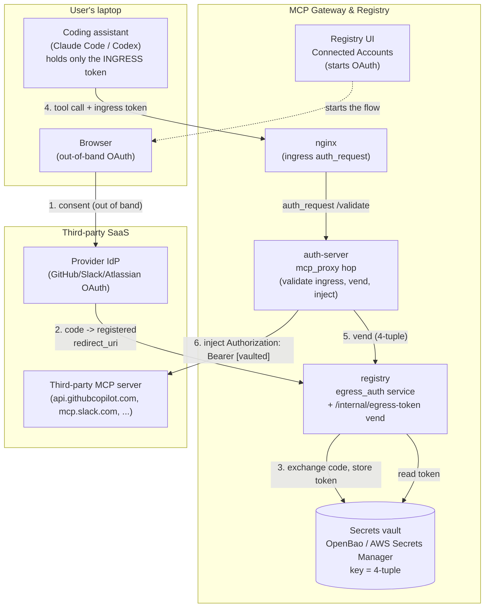
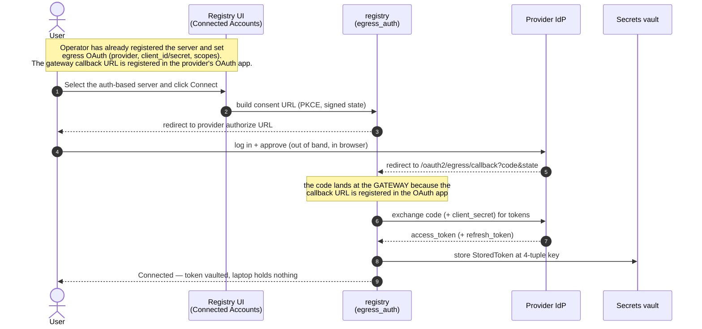
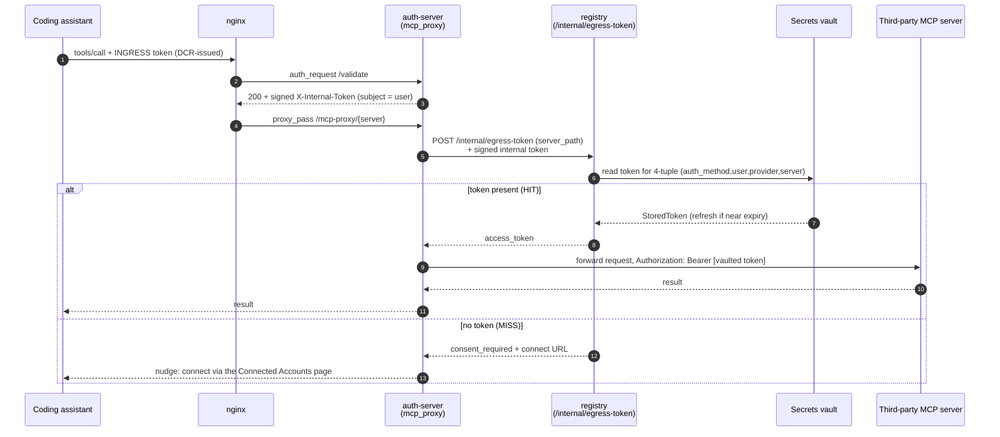
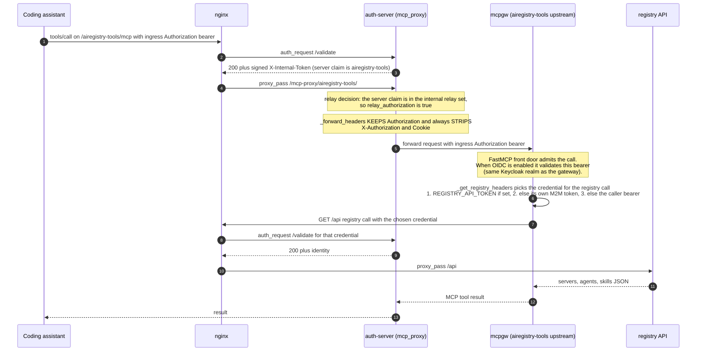

# Egress Authentication Design (Per-User Credentials to Third-Party MCP Servers)

How the MCP Gateway lets a user reach an authentication-protected ("auth-based") third-party MCP server — GitHub, Slack, Atlassian, etc. — **as themselves**, without the coding assistant ever handling the third-party token.

- Status of the modes: **`none` (no egress auth), `vault-oauth` (3LO), `token-exchange` (OBO), and `vault-pat` (PAT) are implemented today** (OBO via Microsoft Entra `jwt-bearer`; Keycloak RFC 8693 is the next phase); a **custom-header** egress mode is designed but not yet built (placeholder below).
- Authoritative implementation references: `registry/egress_auth/`, `registry/secrets/`, `registry/api/egress_auth_routes.py`, `auth_server/server.py` (`mcp_proxy`, `_vend_egress_token`, `_forward_headers`).

---

## First principle: client auth headers are INGRESS-only

Everything below rests on one rule. Every auth header a client sends (`Authorization`, `X-Authorization`, `Cookie`) is an **ingress** credential: it authenticates the caller **to the gateway** and is **stripped on the egress hop** — it is never forwarded to an upstream MCP server. A coding assistant only ever holds its gateway ingress token; it never holds an upstream credential.

The upstream credential (when the server needs one) is supplied **by the gateway**, from the egress vault — never by relaying a client header. This is what makes "no third-party token on the laptop" true by construction.

**The one exception** is the gateway's own built-in, same-trust-domain registry-tools server (`airegistry-tools`, proxied to the bundled mcpgw). A hardcoded, non-configurable constant (`_INTERNAL_INGRESS_RELAY_SERVERS` in `auth_server/server.py`) relays the ingress `Authorization` to it (never `X-Authorization`/`Cookie`). This is internal plumbing, not a user-facing relay feature — a server registrant cannot enable it.

---

## The core idea (in one paragraph)

The user's OAuth to the third party happens **out of band** from the coding-assistant ↔ gateway interaction. The gateway UI provides an easy way to start the OAuth flow with the third-party ("auth-based") MCP server. The thing that **links the gateway to the third-party MCP server is the redirect URL** you configure when creating the OAuth app on the third-party side (`https://<gateway>/oauth2/egress/callback`). When the user completes the OAuth flow, the third party sends the authorization code to the gateway **because that callback URL is registered in the OAuth app** — the gateway exchanges it for a token and stores that token in a secrets vault, keyed by a **4-tuple** `(auth_method, user_id, provider, server_path)`. Later, when the user (through their coding assistant) calls that MCP server, the assistant only presents its **ingress token** (obtained via DCR today; CIMD in the future). The gateway validates the ingress token, looks up the vault for a token matching this user + this server (the 4-tuple), and if present **injects it as the `Authorization` header** on the outbound request to the third-party MCP server. Everything just works, and **the third-party token is never stored on the user's laptop.**

---

## Block diagram



Key properties visible in the diagram:

- The **redirect URL** (`/oauth2/egress/callback`) is the only link between the gateway and the provider IdP — it is what causes the code (and thus the token) to land at the gateway rather than the laptop.
- The **coding assistant only ever holds the ingress token** (its credential to the gateway). It never sees the third-party token.
- The **vault is the single source of truth** for third-party tokens, addressed by the 4-tuple.

---

## The vault key: a 4-tuple

Every stored third-party token is addressed by `(auth_method, user_id, provider, server_path)` (`registry/egress_auth/schemas.py`, `registry/secrets/openbao/store.py`). In the OpenBao KV v2 backend the path is (each segment base64url-encoded so it is path-safe):

```
{mount}/data/{prefix}/{enc(auth_method)}/{enc(user_id)}/{enc(provider)}/{enc(server_path)}
```

| Segment | Meaning | Example |
|---------|---------|---------|
| `auth_method` | The canonical ingress auth method the user logged in with | `oauth2` |
| `user_id` | The verified user's canonical OIDC `sub` (from the signed ingress claims; falls back to username for non-OIDC callers) | `00000000-0000-0000-0000-000000000000` |
| `provider` | The egress OAuth provider | `github` / `slack` / `atlassian` / `custom` |
| `server_path` | The registered MCP server path | `/slack` |

The stored payload (`StoredToken`) holds `access_token`, optional `refresh_token`, `expires_at`, `status`, and timestamps — the vault read returns everything needed to decide vend-vs-refresh. **There is no companion app-DB row; the vault is the only place token state lives.**

Because the key includes `user_id`, one user can never vend another user's token — the identity comes from the **verified** signed internal-hop claims, not a forgeable header.

---

## Setup sequence (one-time, per user, out of band)



The consent `state` is AEAD-encrypted and session-bound (anti-phishing): the callback verifies the opener is the same user who started the flow, so a stolen consent URL opened by someone else cannot bind a token to the wrong account.

---

## Runtime sequence (every tool call)



What each hop guarantees:

- **`/validate`** binds the verified `subject` (user identity) into a signed `X-Internal-Token`. `mcp_proxy` reads identity from these verified claims, not from forgeable inbound headers (internal-hop hardening).
- **`/internal/egress-token`** (registry) is guarded by internal auth, re-checks the server is `egress_auth_mode == oauth_user`, and returns the access token only (never the refresh token). Lazy refresh + cross-replica single-flight happen here.
- **Injection** happens last in `mcp_proxy`: the user's own gateway credentials/identity headers are stripped and replaced with `Authorization: Bearer <vaulted third-party token>`. The token never transits the coding assistant.

---

## Why this is simple and safe

- **Out-of-band OAuth.** The consent dance is entirely separate from the assistant ↔ gateway traffic; the assistant is never part of the third-party OAuth. It only does its own ingress auth (DCR today, CIMD in future).
- **The redirect URL is the link.** Registering `https://<gateway>/oauth2/egress/callback` in the provider's OAuth app is what routes the token to the gateway instead of the laptop. No token ever lands on the user's machine.
- **The 4-tuple keeps it per-user and per-server.** A vault lookup that includes the verified user identity means users can only ever use their own tokens, and only for the servers they connected.
- **The vault is the single source of truth.** Tokens live only in OpenBao / AWS Secrets Manager; there is no copy in the app DB and none on the client.

### Why this matters for enterprise security & governance

The gateway **owns the authentication to every third-party MCP server**, which turns a sprawl of per-laptop credentials and outbound connections into a single, governable choke point:

- **No third-party tokens on user machines.** The token exists only in the vault and is injected server-side. A lost/compromised laptop leaks no third-party credentials; offboarding a user is a vault delete, not a hunt across devices.
- **Clients need connectivity only to the gateway, not to each MCP server.** All egress to GitHub/Slack/Atlassian/etc. originates from the gateway. In an enterprise you can put the gateway in a controlled network zone with the only sanctioned outbound path, instead of allowing every developer machine to reach every SaaS endpoint directly.
- **One place to enforce and observe.** Access control (which user may reach which server), credential rotation/revocation, per-call audit logging, and network egress policy are all applied at the gateway — centrally — rather than replicated and hoped-for on each client.

---

## The internal relay: airegistry-tools -> registry API (sequence)

The one exception to "client auth headers are stripped on egress." `airegistry-tools` is the gateway's own bundled registry-tools MCP server (the `mcpgw` service). It is same-trust-domain, so a hardcoded constant (`_INTERNAL_INGRESS_RELAY_SERVERS = {"airegistry-tools"}` in `auth_server/server.py`) relays the ingress `Authorization` to it (never `X-Authorization`/`Cookie`). The mcpgw server then needs to call the **registry API** (list/search servers, agents, skills) — and it chooses which credential to present for that call, NOT the relayed one by default.

Key point: the relayed ingress `Authorization` lets mcpgw's FastMCP front door admit the MCP call when it is configured to validate a bearer (`OIDC_ENABLED=true`). For its OUTBOUND registry API calls, mcpgw's `_get_registry_headers` picks a credential by priority — static `REGISTRY_API_TOKEN`, else its own M2M token, else (fallback) the caller's bearer. So in the common deployment mcpgw reaches the registry as **itself** (M2M), not by forwarding the user's token again.



What this shows:

- **The relayed `Authorization` is only for reaching mcpgw's front door** (the internal same-trust hop). It is NOT forwarded onward to any third party.
- **mcpgw calls the registry API as itself** (M2M) in the standard deployment, so the user's token is not chained through a second time; `REGISTRY_API_TOKEN` overrides that if an operator sets it. The caller-bearer fallback only applies when neither is configured.
- **`X-Authorization` and `Cookie` are stripped even on this relay path** — only `Authorization` is relayed, and only for this one hardcoded internal server.

### Operational note: SSRF guard and internal MCP hosts

The registry's outbound SSRF guard (`registry/utils/url_guard.py`, `PROXY_PROFILE`) fails closed on any `proxy_pass_url` that resolves to a **private/internal IP** — which every in-cluster MCP server does (Docker Compose service names, ECS Service Connect aliases, Kubernetes service names all resolve to private addresses). Without an allowlist entry the server's **health check** returns `UNHEALTHY_URL_BLOCKED`, even though the server itself is fine.

`mcpgw-server` (the backend for the built-in `airegistry-tools`) is trusted by default via a small hardcoded set (`_BUILTIN_PROXY_ALLOWED_HOSTS` in `url_guard.py`), so the bundled registry-tools server stays healthy with no configuration.

**If you add more internal, same-cluster MCP servers** (another first-party server reached over a private hostname, e.g. an additional `*-server` service on ECS/EKS/Compose), you must opt each one into the SSRF guard or it will show Unhealthy. Do this with the operator allowlist settings (these are UNIONED with the built-in set, never replace it):

- `SSRF_ALLOWED_HOSTS` — comma-separated internal hostnames, e.g. `SSRF_ALLOWED_HOSTS=my-other-server,another-mcp-server`.
- `SSRF_ALLOWED_CIDRS` — comma-separated private CIDR ranges when you prefer to trust a whole internal subnet, e.g. `SSRF_ALLOWED_CIDRS=10.0.0.0/8`. Useful on ECS/EKS where the task/pod subnet is stable.

Wire the chosen value on the **registry** container across your deployment surface (`.env` / `docker-compose*.yml`, the registry Helm values, or the Terraform/ECS registry env block). Public-internet MCP upstreams (e.g. `https://mcp.slack.com`) need no allowlisting — they resolve to public IPs and pass the guard. The cloud metadata endpoint (`169.254.169.254`) is never allowlistable, regardless of these settings.

---

## The egress modes

`egress_auth_mode` on the server entry selects how the gateway obtains the outbound credential. Today the **no-auth**, **vault-OAuth (3LO)**, **token-exchange (OBO)**, and **vault-PAT** paths are implemented; the **custom-header** mode is designed and reserved.

| Mode | Vault used? | How the egress credential is obtained | Status |
|------|-------------|----------------------------------------|--------|
| **`none` (no egress auth)** | No | The server needs no upstream credential. All client auth headers are stripped on egress; nothing is injected. The default for every server. | **Implemented** (`egress_auth_mode = "none"`) |
| **`vault-oauth` (3LO)** | Yes | User completes provider OAuth (3LO) out of band; the gateway vaults the per-user token and injects it. This document's main flow. | **Implemented** (`egress_auth_mode = "oauth_user"`) |
| **`token-exchange` (OBO)** | No | For same-trust-domain backends, the gateway exchanges the user's ingress token for a backend-audience token (Entra `jwt-bearer` / Keycloak RFC 8693). `sub` preserved; nothing stored. | **Implemented** (`egress_auth_mode = "obo_exchange"`; Entra `jwt-bearer` today, Keycloak RFC 8693 next) |
| **`vault-pat` (PAT)** | Yes | A per-user static Personal Access Token / API key is stored in the vault (bounded TTL) and injected into the same header the server's backend auth uses. No OAuth dance. Admin seed-on-behalf supported. | **Implemented** (`egress_auth_mode = "pat"`) |
| **custom-header** | Yes | A per-user credential the operator specifies by header **name + value**, stored in the vault and injected verbatim on egress. For backends with a bespoke/out-of-band auth scheme. Generalizes `vault-pat`. | **Placeholder — not implemented (planned with PAT)** |

> **Internal relay (not a configurable mode).** The built-in `airegistry-tools` server receives the relayed ingress `Authorization` via a hardcoded constant (see "First principle" above). It is not an `egress_auth_mode` value and is not selectable per server — external servers that need an upstream credential use the vault modes above.

### `none` (no egress auth) — implemented

The default. The server needs no upstream credential (or it is a public endpoint). On egress the client's ingress auth headers are stripped (`_forward_headers`) and nothing is injected. Most registered servers are `none`.

### `vault-oauth` (3LO) — implemented

The flow described throughout this document. `egress_auth_mode = "oauth_user"` on the server, `egress_oauth` holds the provider config (client_id, encrypted client_secret, scopes). See [Per-User Egress Credential Vault](../egress-credential-vault.md) and the FAQ [Registering third-party MCP servers](../faq/registering-third-party-mcp-servers.md).

### `token-exchange` (OBO) — implemented

`egress_auth_mode = "obo_exchange"`. When the gateway IdP and the backend share a trust domain (e.g. M365 in the same Entra tenant), the gateway exchanges the user's verified ingress token for a token scoped to the backend's audience and injects that. `sub` is carried cryptographically across the exchange; **no vault, no refresh loop, nothing stored per user.** It fails closed: the ingress token is stripped and, on exchange failure, an error is returned — the ingress token is never relayed and there is no app-only (client-credentials) fallback that would drop the user identity. Its reach is limited to same-trust-domain backends — public SaaS (GitHub/Slack) does not federate with the gateway IdP, so those use `vault-oauth` instead.

Provider support: **Microsoft Entra `jwt-bearer`** (the ingress token is the assertion, requesting the backend app audience) is implemented today. **Keycloak RFC 8693 token exchange** (ingress token as the subject token, backend as the audience) is the next phase and currently raises a not-implemented error. The exchange reuses the auth-server's configured IdP token endpoint and client credentials, runs on the async egress path, and logs no token material. Implementation: `auth_server/egress_obo.py` (`obo_exchange`) and the `mcp_proxy` egress hop in `auth_server/server.py`.

### `vault-pat` (PAT) — implemented

`egress_auth_mode = "pat"`. For backends that only accept a static Personal Access Token / API key, each user submits their own PAT out of band on the **Connected Accounts** page; the gateway stores it in the same vault (keyed by the same `(auth_method, user_id, provider, server_path)` 4-tuple) and injects it on egress, skipping the OAuth dance. Same "token never on the laptop" property as 3LO.

Key properties:

- **Write-only secret.** The PAT is stored, never returned or logged; status endpoints report presence + expiry only.
- **Mandatory bounded lifetime.** The submit takes `ttl_value` + `ttl_unit` (minutes/hours/days, capped at 30 days) — there is no "never expires". Expiry is re-checked at vend, so a stale PAT is a miss (fail-closed).
- **Header inherited from backend auth.** The PAT is injected into the SAME header the server's Backend Authentication uses (`bearer` → `Authorization: Bearer <PAT>`; `api_key` → the configured header with a bare token; default `Authorization: Bearer`). The operator configures the header once, in Backend Authentication — there is no separate egress header config.
- **Per-user identity, admin gated.** `sub` comes from the verified ingress identity; only an admin may seed a PAT for another user, and an on-behalf write must also state the target's ingress `auth_method` (the vault partition the target vends from), failing closed otherwise.
- **CSRF-protected mutations.** Submit (PUT) and delete (DELETE) require CSRF; status (GET) does not. The vend path re-checks the bound upstream against the registered set and strips any client-supplied copy of the inject header, so only the gateway-injected value reaches the upstream.
- **Miss is terminal.** Unlike 3LO there is no interactive flow to offer; a miss (never submitted or expired) returns an actionable "submit a PAT on Connected Accounts" tool result rather than looping.

Endpoints: `PUT`/`GET`/`DELETE /servers/{path}/egress-pat` (registry). Vend: a `pat` branch in `/internal/egress-token` placed before `oauth_user` so a PAT server (stored with `client_id=None`) never routes through the OAuth refresh path.

### custom-header — placeholder (planned)

> Not yet implemented. Design intent: the replacement for "I did the auth out of band and just want to send a token to this upstream" where the header is not derivable from the server's backend-auth scheme. The operator specifies the header **name** and **value** in the registry UI/API; the value is stored in the same secrets vault (keyed by the 4-tuple) and injected verbatim under that header name on egress — like `vault-pat`, but for a backend whose scheme is a fully bespoke format the backend-auth inheritance cannot express. This is the sanctioned way to reach a custom-auth upstream now that client-header relay is ingress-only; it is a relay-free follow-on to the shipped `vault-pat` mode.

---

## References

- [Per-User Egress Credential Vault](../egress-credential-vault.md) — operational guide
- [Registering third-party MCP servers (FAQ)](../faq/registering-third-party-mcp-servers.md)
- [Internal-hop authentication](internal-hop-authentication.md) — the signed `X-Internal-Token` this relies on
- Code: `registry/egress_auth/`, `registry/secrets/`, `registry/api/egress_auth_routes.py`, `auth_server/server.py`
