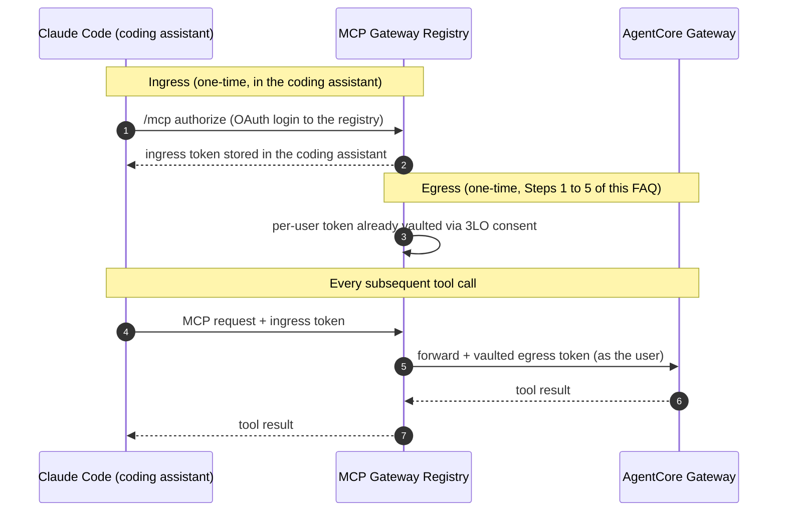

# How do I use a 3LO (per-user OAuth) AgentCore Gateway with the registry?

This FAQ explains how to make an Amazon Bedrock AgentCore Gateway that authenticates with OAuth work with the registry's **three-legged OAuth (3LO)** per-user egress path, so that a coding assistant (Claude Code, Cursor, VS Code, or any MCP client) calls the gateway **as the individual end user** rather than with a single shared machine credential.

The worked example uses **Amazon Cognito** with **Claude Code**, because that is what we verified end to end. The important thing to understand up front: this works the same way for any OIDC identity provider and any coding assistant. The moving parts are identical; the only per-provider quirks are in how scopes are named and formatted (see [What is provider-specific?](#what-is-provider-specific)).

**Watch the walkthrough:** [OAuth 3-Legged Authentication (3LO) demo](https://github.com/user-attachments/assets/3585d258-66a1-458a-bc86-450f917f7cfd).

If you just want a shared service token (machine-to-machine), use [bulk auto-registration](agentcore-bulk-registration.md) instead. That path does not need any of the steps below.

## Background: 3LO vs. M2M

An AgentCore Gateway with a `CUSTOM_JWT` authorizer accepts JWTs from an OIDC provider. There are two very different ways to obtain those JWTs:

| | Machine-to-machine (M2M) | Three-legged OAuth (3LO) |
|---|---|---|
| OAuth grant | `client_credentials` | `authorization_code` (+ PKCE) |
| Who the token represents | A service/application | An individual human user |
| Browser login required | No | Yes (one-time consent) |
| Registry egress mode | static token / auto-registration | `oauth_user` (per-user vault) |
| Callback/redirect URL needed | No | Yes |

This FAQ is about the **3LO** column.

## How the two tokens fit together

There are **two** tokens in play, and they are easy to conflate:

- **Ingress token**: how your coding assistant authenticates **to** the gateway. Created in the coding assistant itself when you add the server and run its OAuth login (`/mcp`, then authorize). See [Step 6](#step-6-add-the-gateway-to-your-coding-assistant).
- **Egress token**: how the gateway authenticates to the upstream AgentCore gateway **as you**. This is the per-user token vaulted by the 3LO consent flow in Steps 1 to 5.

Once both exist, a tool call flows straight through with no further prompts:



> **Key provider constraint (Cognito, and common elsewhere):** a single OAuth app client usually cannot enable both the `client_credentials` and the `code` flow at the same time. Cognito rejects it outright: `client_credentials flow can not be selected along with code flow or implicit flow`. So for 3LO you create a **separate** app client dedicated to the `code` flow, and add it to the gateway's list of allowed clients alongside any existing M2M client.

## What you need before you start

- An AgentCore Gateway with a `CUSTOM_JWT` authorizer backed by an OIDC provider (Cognito, Auth0, Okta, Entra ID, Keycloak, or any custom OIDC IdP).
- Admin access to that OIDC provider (to create an app client and set a redirect URL).
- Admin access to the running MCP Gateway Registry.
- The registry's egress vault feature enabled (`EGRESS_AUTH_ENABLED=true`) with a public callback base URL set (`EGRESS_OAUTH_CALLBACK_BASE_URL`). See the [Per-User Egress Credential Vault](../egress-credential-vault.md) guide.

Throughout, the registry's callback URL is:

```text
{EGRESS_OAUTH_CALLBACK_BASE_URL}/oauth2/egress/callback
```

In our verified example that was `https://mcpgateway.example.com/oauth2/egress/callback`.

## Step 1: Create a 3LO OAuth app client in your IdP

Create a **new** confidential app client (with a client secret) configured for the `authorization_code` flow, and register the registry's callback URL as its redirect URI.

Cognito example (any IdP is the same idea, different console):

```bash
aws cognito-idp create-user-pool-client --region us-east-1 \
  --user-pool-id us-east-1_XXXXXXXXX \
  --client-name "geo-mcp-registry-3lo" \
  --generate-secret \
  --explicit-auth-flows ALLOW_REFRESH_TOKEN_AUTH \
  --supported-identity-providers COGNITO \
  --allowed-o-auth-flows code \
  --allowed-o-auth-flows-user-pool-client \
  --allowed-o-auth-scopes "openid" "email" "profile" \
      "simple-agentcore-gateway/gateway:read" "simple-agentcore-gateway/gateway:write" \
  --callback-urls "https://mcpgateway.example.com/oauth2/egress/callback"
```

Note the returned **Client ID** and **Client Secret**.

> **Tip (AWS CLI quirk):** if `--callback-urls` fails with "Unable to retrieve ... non 200 status code", the CLI is trying to fetch the URL. Disable that once with `aws configure set cli_follow_urlparam false` and retry.

For a Cognito pool you also need its Hosted UI domain enabled so the login page renders (`https://<domain>.auth.<region>.amazoncognito.com`). Other IdPs expose their authorize/token endpoints directly.

## Step 2: Add the new client to the gateway's allowed clients

The gateway's authorizer only trusts specific client IDs. Add the new 3LO client so tokens it mints are accepted. Keep any existing M2M client in the list.

```bash
aws bedrock-agentcore-control update-gateway --region us-east-1 \
  --gateway-identifier geo-mcp-XXXXXXXXXX \
  --name geo-mcp \
  --role-arn "arn:aws:iam::123456789012:role/agentcore-geo-mcp-role" \
  --protocol-type MCP \
  --authorizer-type CUSTOM_JWT \
  --authorizer-configuration '{"customJWTAuthorizer":{
      "discoveryUrl":"https://cognito-idp.us-east-1.amazonaws.com/us-east-1_XXXXXXXXX/.well-known/openid-configuration",
      "allowedClients":["<existing-m2m-client-id>","<new-3lo-client-id>"]}}'
```

Wait for the gateway to return to `READY`.

On other IdPs there is no "allowed clients" list on a gateway to edit; instead the equivalent is making sure the gateway's authorizer audience/client validation accepts your new client. The principle is the same: the gateway must trust the client that mints the user token.

## Step 3: Find your IdP's authorize and token endpoints

Every OIDC provider publishes them at its discovery document:

```bash
curl -s "https://cognito-idp.us-east-1.amazonaws.com/us-east-1_XXXXXXXXX/.well-known/openid-configuration" \
  | python3 -c "import sys,json; d=json.load(sys.stdin); print(d['authorization_endpoint']); print(d['token_endpoint'])"
```

For Cognito these are the Hosted UI domain URLs, e.g.:

- Authorize: `https://us-east-1xxxxxxxxx.auth.us-east-1.amazoncognito.com/oauth2/authorize`
- Token: `https://us-east-1xxxxxxxxx.auth.us-east-1.amazoncognito.com/oauth2/token`

## Step 4: Configure custom-OIDC egress on the server in the registry

Register the gateway as an MCP server (if not already), then configure per-user egress OAuth on it. This is admin-only. You can do it in the server-edit modal in the UI, or via the API:

```bash
curl -X POST "https://mcpgateway.example.com/api/servers/geo-mcp/egress-auth" \
  -H "Authorization: Bearer <admin-token>" \
  -H "Content-Type: application/json" \
  -d '{
        "egress_auth_mode": "oauth_user",
        "egress_provider": "custom",
        "client_id": "<new-3lo-client-id>",
        "client_secret": "<new-3lo-client-secret>",
        "scopes": ["openid", "simple-agentcore-gateway/gateway:read", "simple-agentcore-gateway/gateway:write"],
        "custom_authorize_url": "https://us-east-1xxxxxxxxx.auth.us-east-1.amazoncognito.com/oauth2/authorize",
        "custom_token_url": "https://us-east-1xxxxxxxxx.auth.us-east-1.amazoncognito.com/oauth2/token"
      }'
```

Field notes:

- `egress_provider: custom` is the generic OIDC path. Built-in providers (`github`, `google`, `atlassian`, `microsoft`, `slack`) skip the two `custom_*` URLs.
- `client_secret` is write-only: Fernet-encrypted with the gateway `SECRET_KEY`, never echoed back.
- `custom_scope_separator` defaults to a single space. Leave it blank. (See the [scopes gotcha](#the-1-gotcha-scopes) below.)
- `custom_token_auth_style` defaults to `post_body`; use `basic_header` only if your IdP requires the secret in an HTTP Basic header.
- `custom_resource` (optional, RFC 8707) binds the token to one protected resource; needed by some providers (e.g. Atlassian Rovo MCP), not by Cognito.

## Step 5: Run the per-user consent flow from your coding assistant

Point the user's browser at the registry's connect facade for this server:

```text
https://mcpgateway.example.com/oauth2/egress/connect?server=/geo-mcp
```

This redirects to your IdP's Hosted UI / login page, the user signs in and consents, and the callback lands back at the registry, which vaults **that user's** access + refresh tokens keyed by their OIDC `sub`. From then on, every call the coding assistant makes through the gateway transparently vends (and refreshes) that user's token.

In our verified run, the user logged in through the Cognito Hosted UI, consented, and the geo-mcp tool (`geolocation___getGeolocationByIp`) was then callable from Claude Code using the per-user token. The same connect URL works identically whether the client is Claude Code, Cursor, or any MCP client that supports the consent elicitation.

## Step 6: Add the gateway to your coding assistant

With egress consent done, connect the gateway to your coding assistant so it can call it. For Claude Code:

```bash
claude mcp add --transport http geo-mcp https://mcpgateway.example.com/geo-mcp
```

Then start Claude Code, run `/mcp`, and **authorize** the `geo-mcp` server. This runs the coding assistant's own OAuth login against the registry and stores an **ingress** token inside Claude Code. This ingress token is separate from the egress token vaulted in Steps 1 to 5.

From then on the two tokens compose automatically: the ingress token lets Claude Code authenticate **to** the gateway, and the gateway uses your already-vaulted egress token to call the AgentCore gateway **as you**. There are no further prompts on subsequent calls. (See [How the two tokens fit together](#how-the-two-tokens-fit-together) for the sequence.)

Other coding assistants (Cursor, VS Code, and similar) follow the same pattern: add the server URL, then complete the assistant's OAuth authorize step.

## The #1 gotcha: scopes

The single most common failure is a scope formatting mismatch. The consent flow round-trips back to your callback with an error like:

```text
/oauth2/egress/callback?error=invalid_request&error_description=invalid_scope&state=...
```

**Cause:** the scopes were sent comma-separated instead of space-separated. OIDC/OAuth requires a space-delimited scope string; Cognito (and most IdPs) reject commas with `invalid_scope`.

**Fix:**

- Leave `custom_scope_separator` blank (defaults to a single space).
- Enter scopes as separate list entries, never as one comma-joined string:
  - `openid`
  - `simple-agentcore-gateway/gateway:read`
  - `simple-agentcore-gateway/gateway:write`

You can sanity-check a scope string against your IdP before wiring the registry. A valid combination 302-redirects to the login page; an invalid one 302-redirects back with `error=invalid_request`:

```bash
curl -s -o /dev/null -w "%{redirect_url}\n" \
  "https://us-east-1xxxxxxxxx.auth.us-east-1.amazoncognito.com/oauth2/authorize?client_id=<id>&response_type=code&scope=openid+simple-agentcore-gateway/gateway:read&redirect_uri=https://mcpgateway.example.com/oauth2/egress/callback"
```

## "User does not exist" at the IdP login page

If the login page rejects your credentials with "user does not exist", you are almost certainly typing the **registry's** admin login (for example `admin@example.com`) into the **IdP's** login page. Those are different identity stores.

The 3LO login must use a user that exists **in the OIDC provider backing the gateway**. For Cognito that means in that specific user pool (e.g. `us-east-1_XXXXXXXXX`), which may be entirely separate from the registry's own login pool and may be empty.

Create or use a user in that pool. For Cognito:

```bash
aws cognito-idp admin-create-user --region us-east-1 \
  --user-pool-id us-east-1_XXXXXXXXX \
  --username geotest \
  --user-attributes Name=email,Value=geotest@example.com Name=email_verified,Value=true \
  --temporary-password '<TemporaryPassword>' \
  --message-action SUPPRESS
```

The Hosted UI prompts for a permanent password on first login. Also note this pool uses plain usernames (log in as `geotest`, not an email); check your pool's username/alias configuration, as this varies.

## What is provider-specific?

The flow is identical across IdPs. The differences are narrow:

| Concern | Cognito | Other IdPs |
|---|---|---|
| **Scope names** | resource-server-prefixed, e.g. `simple-agentcore-gateway/gateway:read` | Auth0 uses API-audience scopes; Okta uses custom auth-server scopes; Entra uses `api://.../scope` or `.default`; Keycloak uses client scopes |
| **Refresh tokens** | `openid` in scopes + refresh enabled on the client | often an explicit `offline_access` scope (Microsoft, Atlassian, Keycloak) |
| **Login page** | Hosted UI domain must be enabled | authorize endpoint is directly usable |
| **Both flows on one client** | forbidden; use a separate 3LO client | often allowed, but a dedicated client is still cleaner |
| **Allowed-clients on the gateway** | edit `allowedClients` on the AgentCore authorizer | ensure the authorizer's audience/client validation accepts the client |
| **RFC 8707 `resource`** | not required | required by some (Atlassian Rovo MCP) |

Everything else is the same for every provider and every coding assistant: the callback URL, `egress_provider: custom`, the two `custom_*` URLs, the `/oauth2/egress/connect?server=...` consent trigger, and the space-separated scopes rule.

## Troubleshooting

| Symptom | Likely cause / fix |
|---|---|
| Callback returns `error=invalid_request&error_description=invalid_scope` | Comma-separated scopes. Set `custom_scope_separator` blank; enter scopes as separate space-delimited values. |
| IdP login says "user does not exist" | Logging into the wrong identity store. Use a user in the OIDC provider/pool backing the gateway, not the registry's admin login. |
| Cognito refuses to add a callback URL to the M2M client | `client_credentials` and `code` cannot coexist on one client. Create a separate 3LO client (Step 1). |
| `--callback-urls` CLI error "Unable to retrieve ... non 200" | AWS CLI URL-following. Run `aws configure set cli_follow_urlparam false`, then retry. |
| Gateway returns 401/403 to the minted user token | The gateway does not trust the 3LO client. Add it to `allowedClients` (Step 2) and wait for `READY`. |
| Client never gets a consent prompt | The MCP client must support consent elicitation (url mode), and the server's `egress_auth_mode` must be `oauth_user`. |
| "Connection failed" with `state user mismatch` in logs | Session predates the `sub`-persisting login. Log out and back in, then reconnect. |

See the [Egress Credential Vault](../egress-credential-vault.md#operations-and-troubleshooting) guide for the full operations table.

## Related Documentation

- [AgentCore Full Reference](../agentcore.md)
- [Bulk-register AgentCore Gateways and Runtimes](agentcore-bulk-registration.md)
- [Auto-Registration Prerequisites](../agentcore-auto-registration-prerequisites.md)
- [Per-User Egress Credential Vault](../egress-credential-vault.md)
