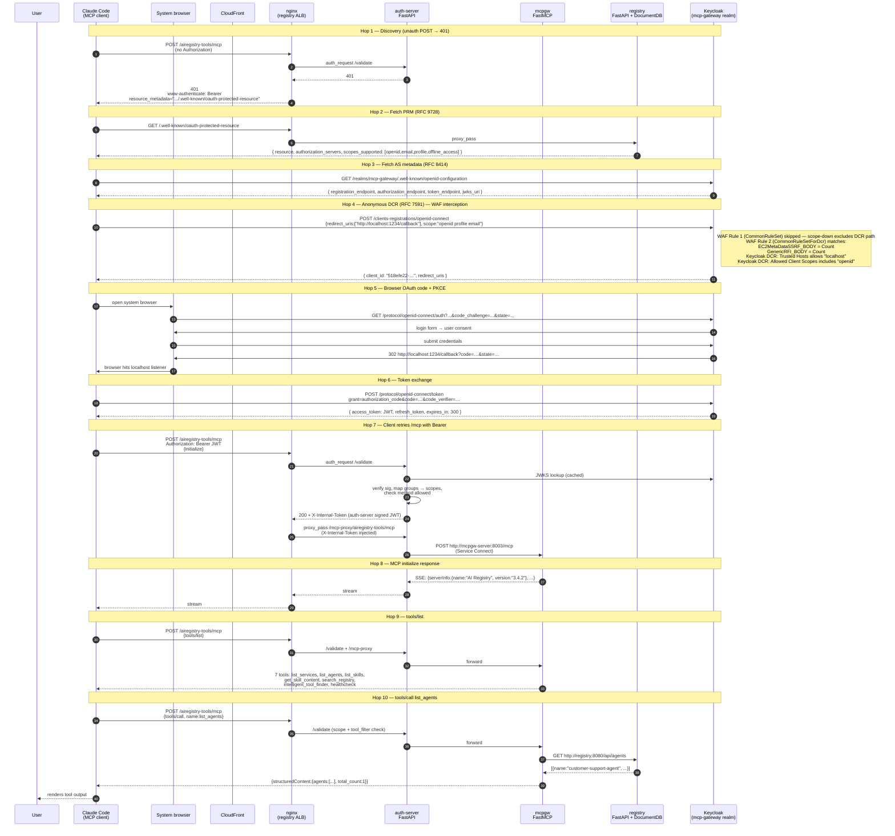
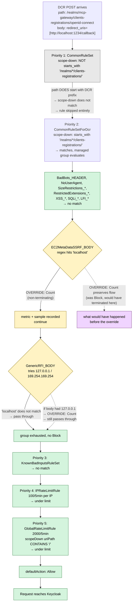
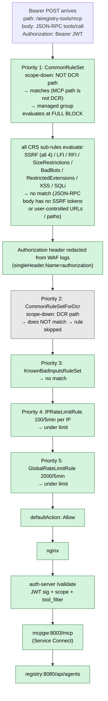

# WAF and MCP Auth Flow

Reference for how WAFv2 is configured on this stack and how a Claude Code (or any MCP) client goes from `/mcp` invocation to a tool response, including where each WAF rule evaluates and what it blocks.

## Table of contents

- [WAF primer](#waf-primer)
- [WAF setup in this stack](#waf-setup-in-this-stack)
- [Sub-rule overrides we apply](#sub-rule-overrides-we-apply)
- [End-to-end MCP flow](#end-to-end-mcp-flow)
- [WAF evaluation order for a DCR request](#waf-evaluation-order-for-a-dcr-request)
- [WAF evaluation order for an MCP tool call](#waf-evaluation-order-for-an-mcp-tool-call)

## WAF primer

AWS WAFv2 sits in front of a resource (ALB / CloudFront / API Gateway). Every request runs through a **Web ACL** — an ordered list of rules — until one rule takes a **terminating action** (`Allow` or `Block`).

Each rule has:

- **Statement** — the match condition (byte match, rate-based, managed rule group reference, regex, etc.)
- **Action** — `Allow` / `Block` / `Count` / `CAPTCHA` / `Challenge` (used on your own rules)
- **OverrideAction** — `None` or `Count` (used only when the rule references a managed rule group)

**Terminating vs non-terminating:**

- `Allow` and `Block` are terminating — evaluation stops.
- `Count` is non-terminating — it records the match in CloudWatch metrics and sampled requests, then keeps evaluating the remaining rules.

**Managed rule groups** are AWS-authored rule bundles (for example `AWSManagedRulesCommonRuleSet` contains around 50 sub-rules covering SQLi, XSS, LFI, RFI, SSRF, size limits, bad bots). You reference them by name; you do not own the internals. Two ways to tune them:

1. **`overrideAction: { count: {} }`** — downgrade the **whole group** from block-mode to count-mode. Everything in the group becomes visibility-only.
2. **`ruleActionOverrides[]`** — **per sub-rule** action override. Leaves the rest of the group at Block, changes only named sub-rules to (usually) `Count`. Cannot narrow by request path.

**`scopeDownStatement`** — an extra condition that gates a rule (managed group or rate-based). The rule only evaluates when the scope-down condition matches. Rate-based rules with `aggregateKeyType=CONSTANT` require a scope-down clause; without it AWS rejects the WebACL at create time. **`ManagedRuleGroupStatement` must be a rule's top-level statement** — it cannot be nested inside `AndStatement` / `NotStatement`. To gate a managed group by path, put the path condition inside the group's own `scopeDownStatement`, not wrapped around it.

**Sampled requests** — AWS records up to ~5000 matched requests per rule in a rolling window (typically 3h). The console shows them as forensic evidence for what fired. This is separate from full logs, which go to CloudWatch / S3 / Kinesis when `LoggingConfiguration` is attached.

## WAF setup in this stack

Two Web ACLs, one per ALB — both REGIONAL scope, us-east-1:

- `mcp-gateway-mcp-gateway-waf` — attached to the registry ALB
- `mcp-gateway-keycloak-waf` — attached to the Keycloak ALB

Both ACLs share the same 5-rule chain (built in `infra/lib/registry/constructs/waf-rules.ts`):

| Priority | Rule | Type | Scope-down | Purpose |
|---|---|---|---|---|
| 1 | `CommonRuleSet` | managed group at Block | path is **NOT** `starts_with(/realms/mcp-gateway/clients-registrations/)` | Full CRS protection everywhere except the anonymous DCR endpoint. |
| 2 | `CommonRuleSetForDcr` | managed group with `EC2MetaDataSSRF_BODY` + `GenericRFI_BODY` set to Count | path **starts_with** `/realms/mcp-gateway/clients-registrations/` | Same managed group, DCR path only, with the two false-positive body rules downgraded to Count. All other CRS sub-rules still Block on this path. |
| 3 | `AWSManagedRulesKnownBadInputsRuleSet` | managed group at Block | — | Known exploit signatures. |
| 4 | `IPRateLimitRule` | rate-based (`aggregateKeyType=IP`) | — | 100 req / 5 min per client IP. |
| 5 | `GlobalRateLimitRule` | rate-based (`aggregateKeyType=CONSTANT`) | `uriPath CONTAINS "/"` (match-all) | 2000 req / 5 min total across all clients. |

Rules 1 and 2 are the same managed rule group referenced twice with **mutually exclusive** scope-down paths. WAF evaluates rules in priority order and stops at the first terminating action (Allow / Block). Because the scope-downs are disjoint, at most one of {Rule 1, Rule 2} matches per request — no double-charging.

Both ACLs also attach a `LoggingConfiguration` that streams matches to CloudWatch log groups `aws-waf-logs-mcp-gateway` and `aws-waf-logs-keycloak`, with `redactedFields: [{ singleHeader: { Name: "authorization" } }]` so bearer tokens do not land in the log.

## Sub-rule overrides we apply

The `CommonRuleSetForDcr` rule (priority 2) downgrades two body-inspection sub-rules from Block to Count, and only applies to Keycloak's anonymous DCR endpoint (`/realms/mcp-gateway/clients-registrations/*`):

| Sub-rule | Matches when… | Override |
|---|---|---|
| `EC2MetaDataSSRF_BODY` | SSRF tokens (`localhost`, `127.0.0.1`, `169.254.169.254`, cloud metadata IPs) appear in the request body | Count |
| `GenericRFI_BODY` | `127.0.0.1` / `169.254.169.254` / other RFI-shaped tokens appear in the body | Count |

**Why** — OAuth Dynamic Client Registration (RFC 7591) for native / CLI clients (Claude Code, Kiro, gcloud, `aws sso login`, GitHub CLI, VS Code) always registers a **loopback callback URI** (RFC 8252):

```json
{"redirect_uris":["http://localhost:1234/callback"], ...}
```

The `localhost` token in the JSON body matches `EC2MetaDataSSRF_BODY`, so at Block the DCR request terminated with an HTML `403 Forbidden` page — which broke every MCP client's OAuth flow. Downgrading to Count lets the DCR reach Keycloak; metric + sample still recorded for observability.

`GenericRFI_BODY` is included because it was **shadowed** by `EC2MetaDataSSRF_BODY` — once the latter was downgraded to Count, `GenericRFI_BODY` became the next terminating match on bodies containing `127.0.0.1` / `169.254.169.254`. Claude Code defaults to `localhost` (which `GenericRFI_BODY` does not match) but clients that emit `127.0.0.1` literals would still trip it without this second override.

**What stays at Block:**

- On the DCR endpoint: `EC2MetaDataSSRF_COOKIE` / `_URIPATH` / `_QUERYARGUMENTS`, all LFI / XSS / SQLi / bad-bots / size-limits / restricted-extensions sub-rules, plus everything else in the managed group.
- On every other path (including registry `/api/*`, MCP `/airegistry-tools/mcp`, `/oauth2/*`, Keycloak `/protocol/openid-connect/token`): the entire CRS runs at full Block via Rule 1, including all 4 `EC2MetaDataSSRF_*` sub-rules.
- Rules 3 (`KnownBadInputs`), 4 (per-IP rate limit), 5 (global rate limit) — untouched.

## End-to-end MCP flow

Full trace of a Claude Code `/mcp` invocation reaching the built-in `ai-registry-tools` MCP server. Sequence diagram first; per-hop payloads below.



### Hop 1 — Client POST /mcp without auth

Client:

```http
POST /airegistry-tools/mcp HTTP/2
Host: d2iekp3sw064ee.cloudfront.net
Content-Type: application/json
Accept: application/json, text/event-stream

{"jsonrpc":"2.0","id":1,"method":"initialize", ...}
```

Server (nginx → auth-server `/validate` subrequest → 401):

```http
HTTP/2 401
www-authenticate: Bearer realm="mcp",
                  resource_metadata="https://d2iekp3sw064ee.cloudfront.net/.well-known/oauth-protected-resource"

{"error":"Authentication required"}
```

Client extracts the `resource_metadata` URL.

### Hop 2 — Client GET Protected Resource Metadata (RFC 9728)

Server (registry FastAPI, `MCP_ADVERTISED_SCOPES` env forces the OIDC-universal scope list):

```json
{
  "resource": "https://d2iekp3sw064ee.cloudfront.net",
  "authorization_servers": ["https://d3oekhpchzd13n.cloudfront.net/realms/mcp-gateway"],
  "scopes_supported": ["openid","email","profile","offline_access"],
  "bearer_methods_supported": ["header"],
  "resource_documentation": "https://d2iekp3sw064ee.cloudfront.net/docs/oauth"
}
```

### Hop 3 — Client GET Authorization Server metadata (RFC 8414)

Keycloak returns the OIDC discovery document. Relevant fields:

```json
{
  "issuer": "https://d3oekhpchzd13n.cloudfront.net/realms/mcp-gateway",
  "authorization_endpoint": ".../protocol/openid-connect/auth",
  "token_endpoint":         ".../protocol/openid-connect/token",
  "registration_endpoint":  ".../clients-registrations/openid-connect",
  "jwks_uri":               ".../protocol/openid-connect/certs"
}
```

### Hop 4 — Anonymous DCR (RFC 7591) — WAF interception point

Client POST to `registration_endpoint`:

```http
POST /realms/mcp-gateway/clients-registrations/openid-connect
Host: d3oekhpchzd13n.cloudfront.net
Content-Type: application/json
User-Agent: node

{
  "redirect_uris": ["http://localhost:1234/callback"],
  "client_name": "Claude Code",
  "token_endpoint_auth_method": "none",
  "grant_types": ["authorization_code","refresh_token"],
  "response_types": ["code"],
  "scope": "openid profile email"
}
```

Request path: CloudFront → ALB → keycloak WAF Web ACL → Keycloak container. See "WAF evaluation order for a DCR request" below for what happens inside the ACL.

If the WAF passes it, Keycloak's DCR policies run:

- `Trusted Hosts` — `localhost` is on the allowlist (relaxed by `keycloak/setup/init-keycloak.sh` `configure_dcr_trusted_hosts`).
- `Allowed Client Scopes` — includes every realm client-scope plus `openid` (appended by `configure_dcr_allowed_scopes`).
- `Consent Required`, `Full Scope Disabled`, etc. — pass.

Keycloak issues:

```json
{
  "client_id": "518efe22-8f96-4d6f-acd6-adddfb60a143",
  "redirect_uris": ["http://localhost:1234/callback"],
  "token_endpoint_auth_method": "none",
  "grant_types": ["authorization_code","refresh_token"],
  "scope": "profile email"
}
```

### Hop 5 — Browser-based authorization_code + PKCE flow

Client opens the system browser at:

```
https://d3oekhpchzd13n.cloudfront.net/realms/mcp-gateway/protocol/openid-connect/auth
  ?response_type=code
  &client_id=518efe22-...
  &redirect_uri=http://localhost:1234/callback
  &scope=openid+profile+email
  &state=<csrf>
  &code_challenge=<pkce-hash>
  &code_challenge_method=S256
```

User authenticates. Keycloak redirects the browser to:

```
http://localhost:1234/callback?code=<auth-code>&state=<csrf>
```

The client's local HTTP listener captures the code.

### Hop 6 — Token exchange

Client:

```http
POST /realms/mcp-gateway/protocol/openid-connect/token
Content-Type: application/x-www-form-urlencoded

grant_type=authorization_code
&code=<auth-code>
&client_id=518efe22-...
&redirect_uri=http://localhost:1234/callback
&code_verifier=<pkce-verifier>
```

Keycloak returns:

```json
{
  "access_token": "eyJhbGci...",
  "expires_in": 300,
  "refresh_token": "eyJhbGci...",
  "id_token": "eyJhbGci...",
  "token_type": "Bearer",
  "scope": "profile email"
}
```

Access token payload (relevant claims):

```json
{
  "iss": "https://d3oekhpchzd13n.cloudfront.net/realms/mcp-gateway",
  "sub": "c385eea8-...",
  "preferred_username": "admin",
  "groups": ["mcp-registry-admin","mcp-servers-unrestricted"],
  "scope": "profile email",
  "exp": 1784...
}
```

### Hop 7 — Client POST /mcp with Bearer

Client retries the original `initialize` call, now with the access token:

```http
POST /airegistry-tools/mcp
Authorization: Bearer <access_token>

{"jsonrpc":"2.0","id":1,"method":"initialize", ...}
```

`auth-server /validate` verifies the JWT signature against Keycloak's JWKS, maps `groups` → registry scopes, and checks the requested MCP method against that scope set. On success nginx `proxy_pass`es the body to `/mcp-proxy/airegistry-tools/mcp`, and auth-server forwards it to `http://mcpgw-server:8003/mcp` over Service Connect (with an `X-Internal-Token` header that mcpgw's own auth guard checks).

### Hop 8 — MCP initialize response

mcpgw returns an SSE frame:

```
event: message
data: {"jsonrpc":"2.0","id":1,"result":{
  "protocolVersion":"2025-03-26",
  "capabilities":{"tools":{"listChanged":true}, ...},
  "serverInfo":{"name":"AI Registry","version":"3.4.2"},
  "instructions":"..."
}}
```

### Hop 9 — tools/list

Client:

```json
{"jsonrpc":"2.0","id":2,"method":"tools/list","params":{}}
```

mcpgw:

```json
{"jsonrpc":"2.0","id":2,"result":{"tools":[
  {"name":"list_services", ...},
  {"name":"list_agents",   ...},
  {"name":"list_skills",   ...},
  {"name":"get_skill_content", ...},
  {"name":"search_registry",   ...},
  {"name":"intelligent_tool_finder", ...},
  {"name":"healthcheck",   ...}
]}}
```

### Hop 10 — tools/call

Client:

```json
{"jsonrpc":"2.0","id":3,"method":"tools/call","params":{
  "name":"list_agents",
  "arguments":{}
}}
```

Auth-server's `tool_filter` checks `airegistry-tools.list_agents` against the scopes derived from the JWT `groups` claim (`mcp-servers-unrestricted` → `.../execute`). If allowed, the request forwards to mcpgw, whose `list_agents()` handler calls the registry HTTP API. Registry queries DocumentDB and returns:

```json
{"jsonrpc":"2.0","id":3,"result":{
  "content":[{"type":"text","text":"..."}],
  "structuredContent":{
    "agents":[{
      "name":"customer-support-agent",
      "description":"Handles customer inquiries via chat",
      "tags":["team:retail-banking","domain:banking","compliance:sox","security-pending"]
    }],
    "total_count":1,
    "status":"success"
  },
  "isError":false
}}
```

Claude Code renders the tool output to the user.

## WAF evaluation order for a DCR request

Detail for Hop 4. Web ACL: `mcp-gateway-keycloak-waf`. Request: POST `/realms/mcp-gateway/clients-registrations/openid-connect`, body contains `http://localhost:1234/callback`.



Legend: grey = rule skipped (scope-down did not match), yellow = matched-but-Count, green = pass, purple = counterfactual reference. Both `EC2MetaDataSSRF_BODY` and `GenericRFI_BODY` are Count-only on the DCR path, so bodies containing `localhost`, `127.0.0.1`, or `169.254.169.254` all pass here — and only here.

**On any other path** (registry API, `/oauth2/*`, MCP endpoint, etc.), Rule 1's scope-down matches and runs the same managed group at full Block, so `EC2MetaDataSSRF_BODY` and `GenericRFI_BODY` still terminate on those tokens.

## WAF evaluation order for an MCP tool call

Detail for Hop 10. Web ACL: `mcp-gateway-mcp-gateway-waf`. Request: POST `/airegistry-tools/mcp`, body is a JSON-RPC `tools/call` payload.



MCP traffic runs against the full-Block CRS via Rule 1 (its scope-down excludes only the Keycloak DCR path). Rule 2 is skipped because the MCP path is not under `/realms/*/clients-registrations/`. JSON-RPC bodies have no user-controlled URLs or filesystem paths, so no CRS sub-rule fires. Active defences on MCP traffic: full CRS (Rule 1), KnownBadInputs (Rule 3), and both rate limiters (Rules 4–5).
